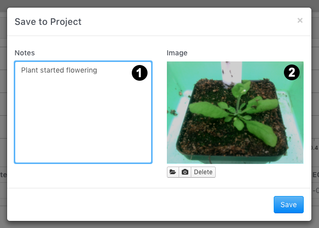

# Adding Notes and Pictures

If you are taking measurements with the desktop app, after every measurement you can attach a note and/or picture that will be viewable online. Notes and pictures can only be added **BEFORE** you save the measurement for Projects to the PhotosynQ platform. When you save measurements to the notebook, notes and pictures can be saved with the measurement at any time.

1. Select **Add Notes** from the menu at the top of the page
2. Type in a note, use the computer's camera to take a picture, or upload an image from your computer.
3. Once you have added all of your notes and images, select **Add**.

