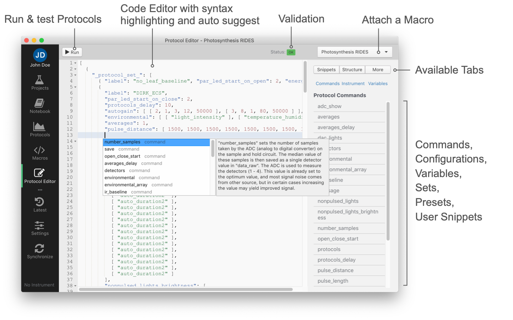

# Protocol Editor

The **Protocol Editor** allows you to build new Protocols or modify existing ones. The Protocol then can be connected to a Macro to calculate parameters from the recorded measurement results.



The Code Editor in general works like any other text or code editor. It has syntax highlighting as well as error checking, so you know at any time, if the protocol has a valid format or not. Also it is helpful, when it comes to formatting, and working with the code. If next to the line number a red icon <i class="fa fa-times-cirle text-danger"></i> appears, there is an error in the code either in that line or above. If there is a yellow warning icon <i class="fa fa-exclamation-triangle  text-warning"></i> the structure of the protocol is correct, but a command used is not correct, or a value provided is not correct. In that case you might be able to run the protocol, but it might not work as expected. When you have an Instrument connect, you will also get the commands for LEDs, Detectors and Miscellaneous Sensors. They are available in the auto-suggest popup, as well as in the sidebar under **more** and then **Instrument**.


## Snippets

In order to get started or to avoid typing the same code over and over again, snippets can be used to make your work more efficient. Just hover over a snippet in the list to see a description, or double click on it to insert it into the code at the cursor position.

**Presets:** These presets are snippets of code provided by PhotosynQ to make it easier to create protocols. You cannot modify the presets. To save your own snippets, use **My Snippets**. To add a preset to the code, just position the cursor where you want to insert it in the code. Double click on the preset in the list to insert it.

**My Snippets:** Here you can save your own snippets. Just highlight the code you want to save and select the **Add** button. Give it a name and hit Enter to save it or ESC to cancel. When hovering over a snippet, use **&times;** to delete a snippet. To add your snippet to the code, just position the cursor where you want to insert it in the code. Double click on the snippet in the list to insert it.

!> **Note:** The snippets are saved locally only.

## Structure

Protocols using `_protocol_sets_` can get very complicated. In this tab a list of available protocols within the set is shown. Drag and Drop the elements of the list to re-arrange the protocols within the set or to delete them, clicking the **&times;** icon. You will not be asked, if you want to delete the set, instead use the shortcut `Ctrl+Z` or `⌘+Z` to undo the last step. Double click a protocol to sets the cursor to the beginning of the selected protocol within the code.

?> **Tip:** Use the command `label` to name your protocols within the set and to have easy access to their output within a Macro.

## More

This tab in the side-bar holds a list of commands, configurations and variables based on the connected instrument or the `v_arrays` inside the protocol. Commands and configurations are also available through the auto-suggest available by typing or using the shortcut `Ctrl+Space` or `^+Space`.

**Commands:** The list of Protocol Commands available for the Instrument. Hover over a command on the list to get detailed information. Double click the command to insert it into the code at your cursor position.

**Instrument:** The Instrument configuration is listed when an Instrument is connected. You can double click on each element in the list, to add the commands into your code. LED's and Detector's are indicated by numbers, whereas sensors are indicated by strings.

**Variables:** The `v_arrays` holds values that can be used together with variables. When pointing to a specific value in an array, you can use the `@n` followed by the number of the array starting at 0 followed by a `:` and the number of the element in the array starting at 0 (e.g. `@n1:0`).

```javascript
...
"v_arrays": [
    [           // Array (1st)  "@s0"
        10,     // Variable     "@n1:0"
        200,
        ...
    ],
    [           // Array (2nd)  "@s2"
        20,     // Variable     "@n2:0"
        400,
        ...
    ],
    ...
],
...
```

Once you have a `v_arrays` defined, you can find a list of all available variables in this tab. Just double click on a set or value to insert into the code.