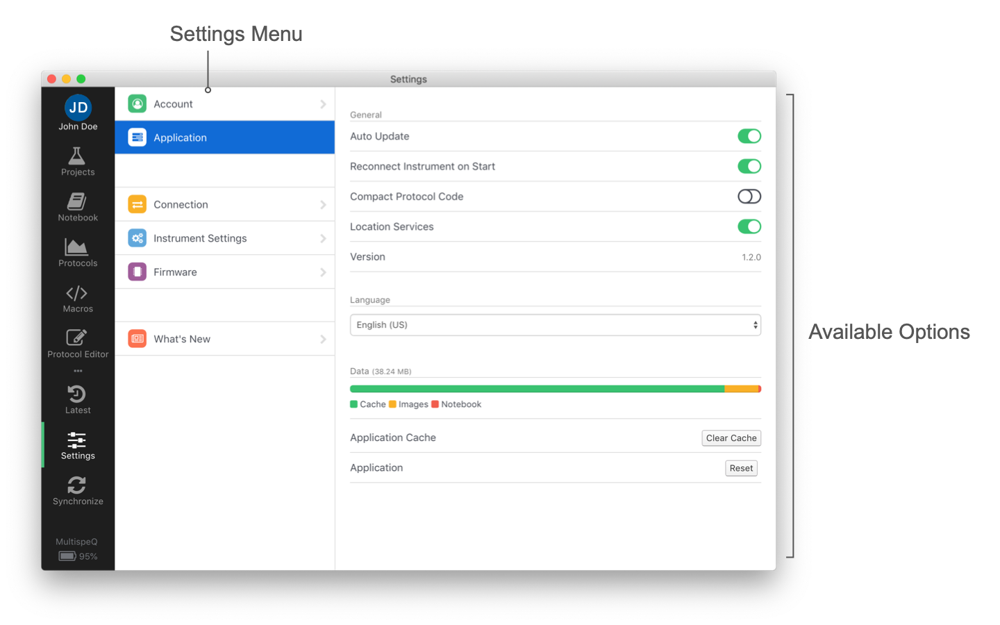

# Settings

You can find the Applications Settings under the **Settings dialog** clicking on **Application**. You can bring up the Settings dialog doing the following:

+ Left Menu bar <i class="fa fa-sliders"></i> Settings Icon
+ **Windows & Linux** Menu → Edit → Preferences
+ **Mac** Menu → PhotosynQ → Preferences

## Auto Update

Updates are automatically downloaded when available helping you to keep your Application up to date. When the download is finished, you can restart the Application to install the update, or wait until you start it up the next time.

When you deactivate the Auto Updates, you will be asked if you want to download the update and install it.

Every time you open the Application it will check for new updates. If you want to check in between, just select *Check for Updates...* from your Menu.

+ **Windows & Linux** Menu → Edit → Check for Updates...
+ **Mac** Menu → PhotosynQ → Check for Updates...

## Reconnect Instrument on Start

When activated, the next time you start the Application, it will try to reconnect to the last connected Instrument.

## Compact Protocol Code

When activated, the code in the Protocol Editor will be shown more compact (350 characters/row) to have a better overview. You can change back and forth at any point.

## Location Services

The Location Services are deactivated by default. We strongly recommend to activate them, so your location is attached to your measurements. This becomes very handy, if you have collaborations across multiple locations.

## Version

Simply the release version of the Application.

## Language

The language used inside the Application. Currently only English is supported. We are planing on providing multi language support. If you are interested in helping us making the application more accessible, please send us an email at <support@photosynq.org>.

## Data

The disk-space used by the Application to save things like Projects, Protocols and Macros, as well as images and your Notebook.

**Reset**
All Projects, Protocols, Macros, images, cached Measurements and your Notebook will be deleted. Also you will be signed out. To synchronize your data from PhotosynQ you have to sign in again.

!> **Note:** Make sure you have your Notebook exported, in case you want to use it in the future.

**Clear Cache**
All Projects, Protocols, Macros and images will be deleted and your data from PhotosynQ will be synchronized again.

!> **Note:** Measurements cached and your Notebook will not be deleted.