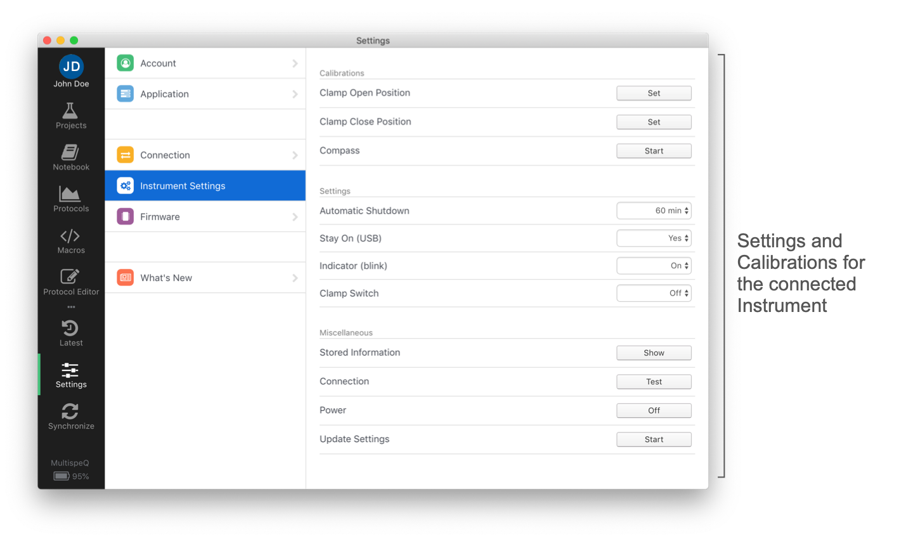

# Instrument Settings

PhotosynQ Instruments have settings, which you can change, to make the Instrument better fit you needs. They vary between Instruments. Currently you need to use the Desktop Application to adjust your Instrument settings.

!> **Note:** The Chrome App does not support Instrument Settings. Please switch to the new Desktop Application.

## Desktop App

When using the Desktop App to change the Instrument settings, follow these steps to get started.

1. Connect your Instrument, using USB or Bluetooth.
2. Select **Instrument** from the **Settings** dialog.
3. Depending on the connected Instrument, you will see your available Settings.

## Settings MultispeQ v1.0

!> **Note:** Available soon

## Settings MultispeQ v2.0

| Setting | Description |
|---------|-------------|
| Automatic Shutdown | The initial shutdown time for Instruments is **30 minutes**. To start it up again you have to hold the button for ~10s to restart the Instrument. Adjust the time by selecting a shutdown interval. |
| Stay On (USB) | When your Instrument is connected through USB, it can be set to not shut down. Once disconnected, it will turn off according the the shutdown time. |
| Indicator (blink) | The Indicator light will flash every 10s, reporting the battery status and that the Instrument is on |
| Clamp Switch | Hold the clamp open and wait for the Indicator light to flash 3 times to shut down the Instrument. |
| Stored Information | Print all values saved on the Instrument |
| Connection | Get a quick *Hello* from your Instrument (e.g. MultispeQ Ready) |
| Power | Switch off your Instrument |