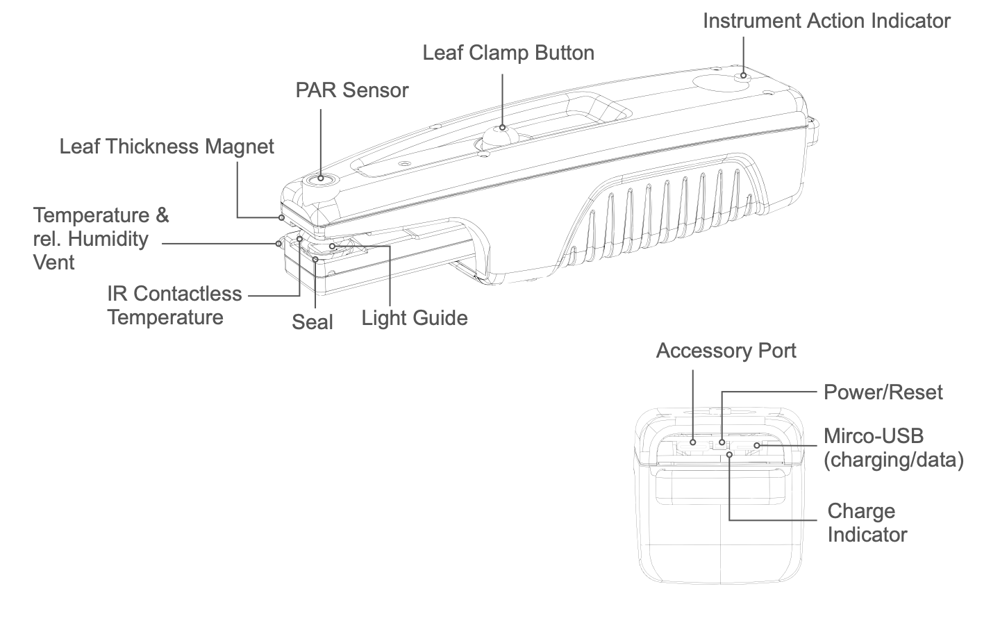

# MultispeQ v2.0

## Getting Started

+ **Charging:** Before using your MultispeQ, charge it for 8 hours using the supplied micro-USB cable\*. When plugged in, the small green LED next to the micro-USB port lights up. Once the instrument is fully charged, the light will turn off.
+ **Turn On:** Press and hold the power/reset button in the rear for 5 seconds.
+ **Software:** Go to <https://photosynq.org/software> and download the Android app or the Desktop app.
+ **Check Tutorials:** Before Using Your Instrument Make Sure To Check Out The "[Getting Started](/tutorials/getting-started)" Tutorials on how tho connect the Instrument and take the first Measurement.

\* Power supply not included. Use a computer or standard USB power supply. Charging time depends on the power output of the power supply.

## About

### Leaf Clamp Button

Push down the leaf clamp button to open the leaf clamp. Push and release with an even motion and prevent it from snapping back. In case the open and closing feels a little rough, a small amount of lithium grease can be used to make the open and closing motion more smoothly.

### PAR Sensor

The PAR sensor located on top of the instrument. When taking measurements, depending on the measurement protocol, the light intensity measured will be replicated inside the instrument. Make sure not to cover or shade the PAR sensor, to prevent altering the actual intensity. Also prevent the sensor from getting dirty.

### Seal

The seal around the light guide on the main body and the clamp is ensuring the area measured is sealed from outside light. The material is  Nitrile.

### Light Guide

The light guide are made from acrylic. Make sure, it is clean and prevent clamping hard materials which can cause scratches.

?> You may need to clean the light guides occasionally. Gently clean the light guides with a damp, soft cloth.

!> Do not submerge in water, do not use solvents or detergents and do not use abrasive or rough cloths to clean the light guides.

### IR Contactless Temperature

The leaf Temperature can be measured with the IR Contactless Temperature. When taking a measurement make sure that the leaf is covering the IR sensor. The sensor is inside a little groove and not flush with the clamp surface. The leaf or material should not touch the the sensor, since it can alter the measured temperature reading.

### Temperature & rel. Humidity Vent

The two vents allowing air to be exchanged inside the Instrument. There are two sensors inside the clamp, one is close to the vents and the light guide, the other one is located on the other end of the clamp. Tubes can be attached in combination with a pump to provide a constant air flow and/or gas exchange.

### Instrument Action Indicator

The Action Indicator has the following

| Indicator | Function |
| --------- | -------- |
|  | Instrument is on, and fully charged. The indicator is flashing every 5s |
|  | Instrument is on, and battery is emptying. The indicator is flashing every 5s |
|  | Instrument clamp open. The indicator is flashing rapidly. |
|  | Instrument is busy (e.g. Measurement). The indicator is constantly on |

### Power/Reset Button

The button in the back allows the instrument to be turned on as well as been reset.

+ Hold the button for at last 5 seconds to turn the Instrument on. Wait for the Action Indicator to start flashing, to confirm the Instrument is on and booted up.
+ A short push on the button will reset the instrument, in case a protocol crashes, etc.
+ When the Instrument is running, hold the button for 5 seconds, to restart the instrument. Wait for the Action Indicator to start flashing, to confirm the Instrument is booted up again.

?> **Tip:** When the rubber port cover is closed, it is easier to push the button.

### Micro-USB

The Micro-USB port allows the Instrument to be charged and when connected to a computer for data transfer. When unplugging the cable, make sure not to bend the cable up and down, to not break of the Instrument connector.

### Accessory Port

The USB-c port allows to attach accessory equipment. When unplugging the cable, make sure not to bend the cable up and down, to not break of the Instrument connector.

### Charge Indicator

The little LED in the back indicates, when the Instrument is charging. When the battery is fully charged, the LED will turn off.