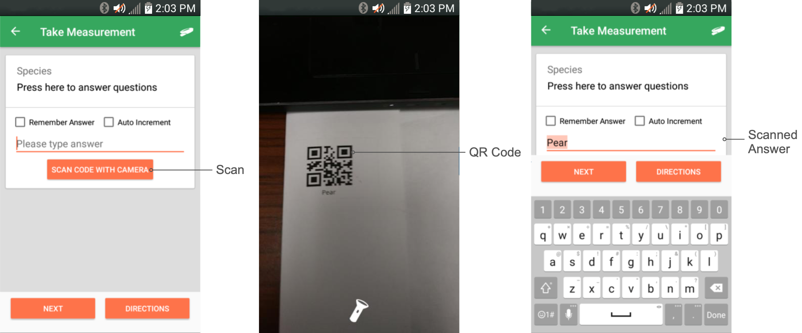
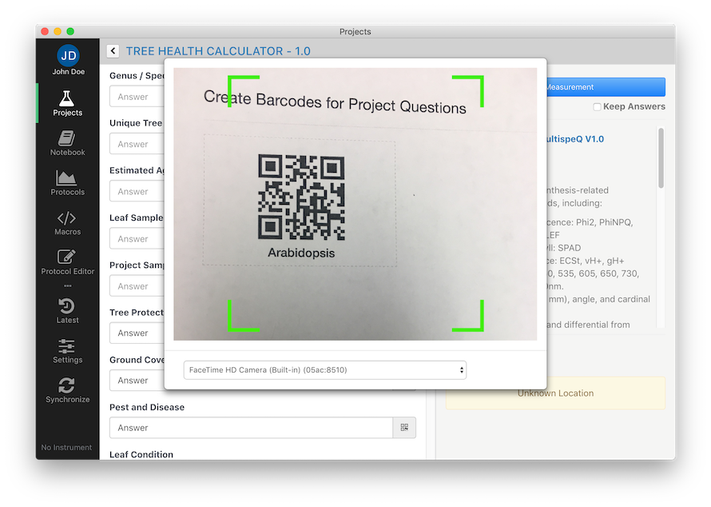
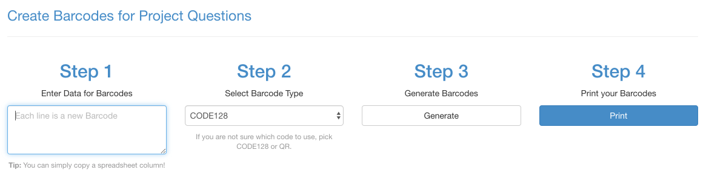
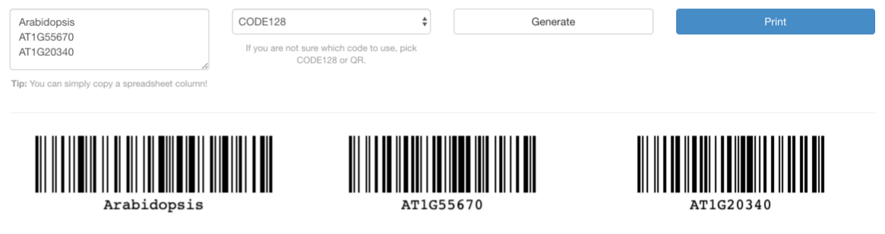
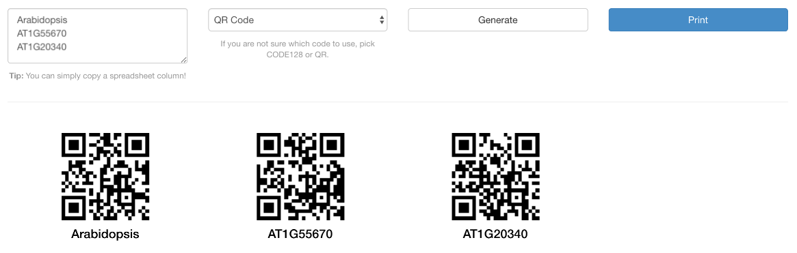
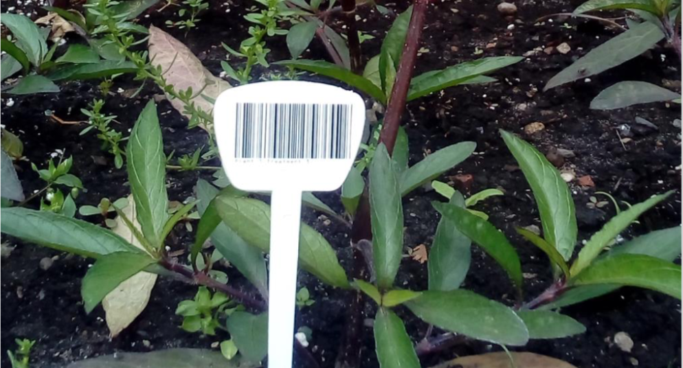

# Barcodes

When conducting large scale experiments, you might have a long list of possible answers to a Project Question. In this case it might be faster to scan a barcode to select an answer compared to scrolling through a list of possible answers. Also, scanning a barcode is less error prone, when it comes to selecting answers like accession numbers from a long list.

!> **Note:** At this point each barcode can only be associated with ONE project question. You would need multiple barcodes to answer multiple questions.

## Reading Barcodes

Both applications, the mobile and the desktop allow scanning barcodes to answer Project questions. The desktop application should allow for external barcode scanners as well.

### Mobile Application

The mobile app is using the devices front camera to scan the barcode.

?> **Tip:** If the camera doesn’t open automatically, make sure that **Barcode auto-capture** is selected in the [application settings](mobile-application/settings).

### Desktop Application

In the desktop application you can scan codes where you see the <i class="fa fa-qrcode"></i> QR code icon. The camera starts and the code can be scanned. If you have multiple cameras, you can select the camera from the dropdown menu. Once the code is recognized, it will be entered into the input field and the camera dialog closes.

?> **Tip:** In case no camera shows up, make sure to grant the application access to the camera.

## Creating Barcodes

If you are not using barcodes in your every day research, you can create different kind of barcodes depending on your needs for your project. Navigate to <https://photosynq.org/codes> to generate a list of barcodes that you can use for data collection.

There are four easy steps to take to generate the barcodes you need. **First**, provide a list with phrases, parameters, etc. that you want to encode in a bar- or QR-code. For each line a new code will be generated. **Second**, you select the type of code you want to use. We recommend to use either the CODE128 or QR-code format since they provide the most compatibility. The **third** step is generating the codes by clicking on the **Generate** button. If you have all the codes needed for your project, you can print the codes by clicking on **Print** or use the print function of your browser.

?> **Tip:** Make sure, you print off the codes not too small or in a low resolution, since some phones might not be able to read the codes. Codes with long words might get very complex which can lead to problems reading the code with low quality cameras.

!> **Note:** Not all types of codes are compatible with numbers, letters or words.

### Choosing CODE128

### Choosing QR-Code

## Use Cases

For projects with . If you are planing on conducting a long term experiment, you probably want to laminate your barcodes or print them on a water resistant material.