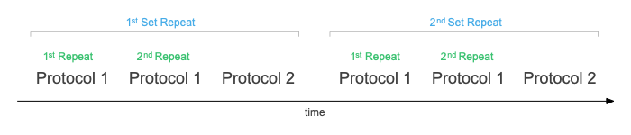
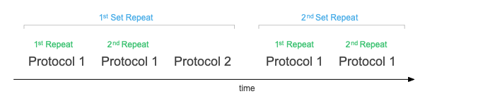

# Repeats

When writing a Protocol, certain parts might be repeated several times. So instead of repeating the instructions several times, defining repeats can help to reduce complexity and make it easier to write the Protocol. A good example for using repeats would be a fluorescence induction kinetic, where a number of saturation pulses is given. With the help of repeats, the protocol for the saturation pulse is defined once and then can be repeated.

?> **Tip**: Repeats can be a very powerful tool when used in combination with protocol-sets reducing the size of a Protocol to a minimum.

## Using Repeats

The following example shows how to use two types of repeats, the `set_repeats` and `protocol_repeats`. Both are optional and can be used alone, depending on your Protocol requirements.

```javascript
[
    {
        "set_repeats": 2,
        "_protocol_set_": [
            {
                "label": "Protocol 1",
                "protocol_repeats": 2,
                ...
            },
            {
                "label": "Protocol 2",
                ...
            }
            ...
        ],
    }
]
```

`set_repeats` have to be used together with the command `_protocol_set_`. When used, the protocols within the protocol-set will be repeated as defined by the number of repeats.

`protocol_repeats` will repeat a single protocol within a `_protocol_set_`. Each protocol can have a different number of repeats.

### Protocol Sequence



## Repeats and variables

When using variable arrays (`v_arrays`) the number of repeats can be based on the number of values within one of the arrays in the `v_arrays`. The array can be referenced using the indicator `#l` with the position (index) of the array `#l<index>`. Find help on how to use variable arrays [here](protocols/variables.md).

```javascript
[
    {
        "v_arrays": [ [ 1, 2 ], [ 1, 2 ] ],
        "set_repeats": "#l0",
        "_protocol_set_": [
            {
                "label": "Protocol 1",
                "protocol_repeats": "#l1",
                ...
            },
            {
                "label": "Protocol 2",
                ...
            }
            ...
        ],
    }
]
```

### Protocol Sequence (variable arrays)


## Skip Repeats

When creating a Protocol using `_protocol_set_` in combination with `set_repeats`, a protocol within a set might only needed to run once. This can be accomplished by using the `do_once` command. The following example shows a Protocol where the second protocol within the set is only run the first time. By setting the value to `1`, the `do_once` command will be executed, by setting it to `0`, it will be ignored.

```javascript
[
    {
        "set_repeats": 2,
        "_protocol_set_": [
            {
                "label": "Protocol 1",
                "protocol_repeats": 2,
                ...
            },
            {
                "label": "Protocol 2",
                "do_once": 1,
                ...
            }
            ...
        ],
    }
]
```

### Protocol Sequence (skip)

