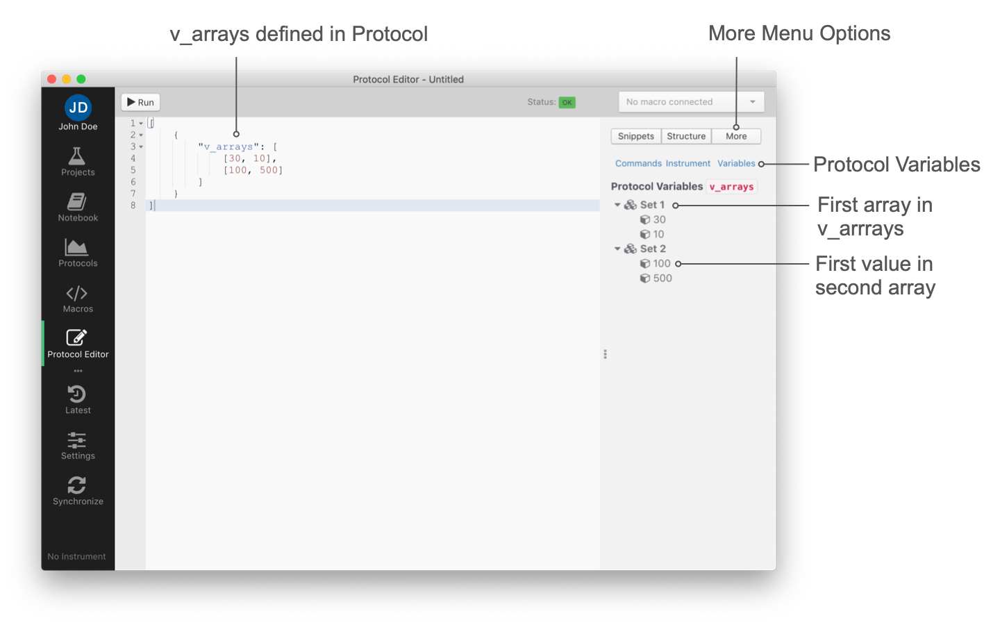

# Variables

Protocols for PhotosynQ instruments can use variables to be more flexible and make it easier to introduce changes, especially when working with long or complicated protocols.

## Defining Variables

The values for the variables in Protocols are saved in the variables arrays (`v_arrays`). Not only do they allow to hold multiple values, but also allow to be used in combination with repeats to change values with each repeat.

When **variables** are supposed to be used, first the `v_arrays` key needs to be added as shown below. The `v_arrays` array can hold up to **4** arrays each with a maximum number of **10** numbers.

```javascript
[
    {
        "v_arrays": [

        ],
        ...
    }
]
```

Now values can be added by adding an array to the `v_arrays` array.

```javascript
[
    {
        "v_arrays": [
            [30, 10],
            [100, 500],
            ...
        ],
        ...
    }
]
```

## Accessing Variables

The Protocol allows you to access the value of the variables arrays (`v_arrays`) by either selecting a specific value or changing the value depending on protocol or  protocol-set repeats. The easiest way to access those variables is using the **Variables** function in the protocol editor.



A double click on a value in the variables tree, will insert the selector for a single value, for example `@n0:1`. When selecting the set with a double click, you will add the selector for a protocol repeat, e.g. `@p0`. In case a selector is needed when a protocol-set is repeated, add the selector for a protocol repeat and replace the `@p` with an `@s`.

## Accessing a Single Value from Variables

In this example the variables are used to define the number of pulses. To indicate that a single value is accessed independent of repeats, use `@n` followed by the position of the array in the variables array `@n<array>` and the position of the value within the selected array `@n<array>:<value>`. So accessing the first array and the second value within that array, `@n0:1` would be used.

```javascript
[
    {
        "v_arrays": [
            [30, 10],
            [100, 500],
        ],
        // pulses: [ 30, 10, 500 ]
        pulses: [ "@n0:0", "@n0:1", "@n1:1" ],
        ...
    }
]
```

!> **Note:** When counting the index (position) of an array or a value within an array, always start at **0**.

## Using Repeats with Variables

Sometimes selecting a single value is not useful when it comes to using variables. This could be the case, if a protocol is build, where with each repeat, the light intensity is changed, the pulse duration increases, a different LED is selected, etc. In this case the `v_arrays` can be used in combination with protocol or protocol-set repeats to provide a different value with each iteration of the protocol.

When repeating a protocol or a protocol within a protocol-set, the variable is selected using `@p` followed by the index of the array within the variable arrays `@p<array`. The following example increases the light intensity with each protocol repeat.

```javascript
[
    {
        "v_arrays": [
            [ 100, 200, 400]
        ],
        ...,
        "non_pulsed_lights_brightness": [ "@p0", ... ],
        "protocol_repeats": 3,
        ...
    }
]
```

If the protocols get more complex, a protocol-set can be used, to run multiple small protocols together as one. When using the

```javascript
[
    {
        "v_arrays": [
            [ 100, 200, 400]
        ],
        "set_repeats": "#3",
        "_protocol_sets_": [
            {
                ...,
                "non_pulsed_lights_brightness": [ "@s0", ... ]
                ...
            }
        ]
    }
]
```

Of cause, the repeats for protocols and protocol-sets can be combined generating nested repeats. This can make the protocol very compact and easy to manipulate, but more difficult to read.