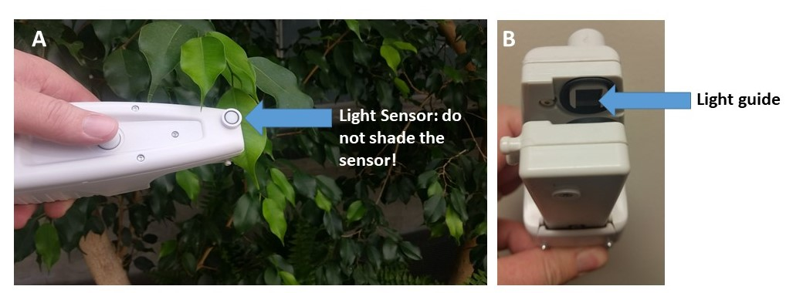
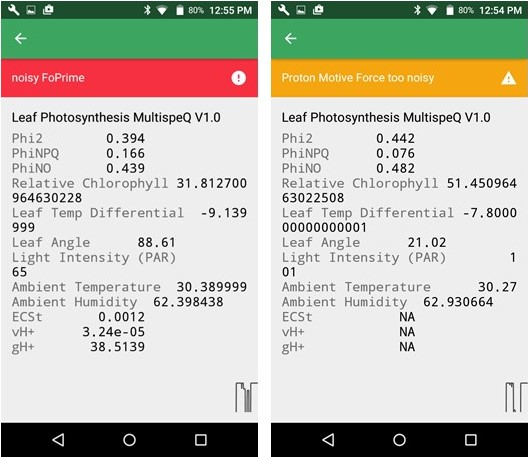
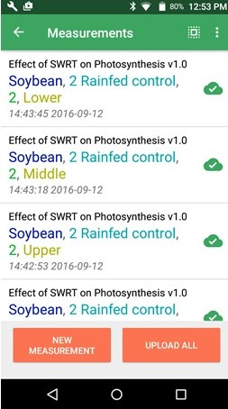
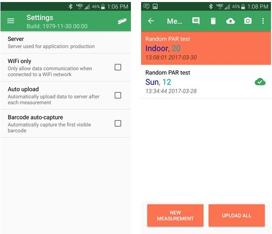

# Taking Quality Measurements
{docsify-readtime}
Once you have selected the Project that you want to contribute measurements to, you can start taking quality measurements by following these steps:

1. Before clamping the leaf, answer all of the questions listed in the Project
2. Select **measure.**
3. Clamp the leaf using the **Best Measurement Practices** listed below. The MultispeQ measures the leaf in its natural state. This means that changing the state of the leaf to take a measurement can affect your results!
4. The protocol will take ~15 seconds to complete. Once the measurement is complete, confirm that the measurement quality is good.
5. Select **ACCEPT** if you want to submit the measurement to the website or **DISCARD** if you want to discard the measurement and try again.

?> **Tip:** If you are using the default protocol **Leaf Photosynthesis v1.0** the measurement will automatically start once you have opened the clamp and closed it over the leaf. Other protocols the measurement may begin as soon as you select **Take Measurement**. - **Make sure you know when the protocol you are using begins!**

#### Best Measurement Practices

   - Do not position your body so you are shading the leaf or the light sensor (A)
   - Do not pull the leaf out of the shade and into the sun or vice versa
   - Do not change the angle of the leaf, this will change how the leaf is intercepting light
   - In order for the compass measurement to be accurate, clamp the leaf on the left side when facing the stem.
   - Make sure the leaf completely covers the light guide (B). If the leaves you are measuring are too small, you may need to [mask](https://photosynqprod.s3.amazonaws.com/files/specialfeatures/measuring-small-leaves.pdf) the light guides and recalibrate the MultispeQ

***

### Understanding a Measurement

Once you have completed a measurement you will have the opportunity to examine it before submitting it to the website. Lets take a quick tour of your measurement!

!> **Note:** This section of the tutorial covers the default MultispeQ plant health protocol: **Leaf Photosynthesis v1.0**, and may not represent the results from other protocols.

The graphical representation of the measurement is called a **trace**. The parameters output by the PhotosynQ platform are generated from values within this trace.

#### Most Important Parameters

Here is a list of the most important parameters and their typical ranges. If your measurement is outside of the given ranges, your measurement may be bad and you may want to discard it and redo the measurement.

|   Parameter  | About |
| :----------- | :-------------------------------------------- |
| Phi2 | The fraction of light energy captured by Photosystem II which is directed towards Photochemistry to make ATP and NADPH and ultimately sugar for the plant to grow. `Typical range is 0 - 0.82` |
| PhiNPQ | The fraction of light energy captured by Photosystem II which is directed towards non-photochemical quenching and is dissipated as heat inside the leaf. The plant actively 'shedding' excess captured light to avoid photo damage. `Typical range is 0 - 0.85` |
| PhiNO | The fraction of light energy captured by Photosystem II that is directed...somewhere. This generally represents light energy lost to unregulated processes that can damage Photochemistry. `Typical range is 0.15 - 0.55` |
| Relative Chlorophyll Content | The concentration of chlorophyll in the leaf. `It ranges from 0-80 and is a relative value so it has no units.` |
| ECSt, vH+, gH+ | These parameters describe the accumulation of protons in the thylakoid and their flow through ATP synthase which converts ADP to ATP, one of the main forms of transportable energy within the cell.  This measurement often does not work well at low light intensities. Under these conditions it is common to get a pop-up message saying that the **signal is too low** or **too noisy** and you should accept the measurement. If you get this message under high light conditions, you may want to retake the measurement |
| Leaf Temp Differential | The difference between leaf temperature and ambient temperature in degrees Celsius. `The typical range is from -5 to +10` |
| Light Intensity (PAR) | Photosynthetically Active Radiation in the 400 - 700 nanometer wavelengths that is used for photosynthesis. `Typical ranges 0 to approximately 2000 microeinsteins (under full sun)` |

If you click on **Show More** you can see many more details about the sensor readings. Additional information about PhotosynQ parameters can be found [here](instruments/what-does-the-multispeq-measure.md).

***

### Submitting Quality Measurements

Now that you are familiar with the parameters, you can check the quality of each measurement. If a measurement is out of the acceptable range or is too noisy a red **danger** or yellow **warning** notification will pop up describing the problem. Blue notifications are for information only.

?> **Tip:** The easiest way to ensure quality data is to discard poor data before it gets submitted to the website!

One of the most common warning messages you will receive is that your data is too noisy. Noise can come from the sample shaking in the wind, the leaf slipping in the measurement chamber or a shaky hand. Stabilizing your hand and leaf stem often helps, but sometimes things are more complex. For example, if you measure a dead leaf, the app informs you that the values are very low, meaning that either you didn't measure a plant or something is probably wrong.

You can chose to keep the measurement from a dead leaf as a legitimate value or discard it. It depends on your Project goals.

If the measurement seems okay, values are in the reasonable range and there are no warnings you can go ahead and submit the measurement.

Once you submit the measurement you can see it in the **Measurements** tab, available in the menu on the android app. If there is a check next to the measurement, it has been submitted to the website.

To take another measurement, click on **new measurement**.

#### Submit Cached Data

If you would prefer to manually submit your data, or to limit the auto upload feature to when you have wifi connection only (to avoid using mobile data), go to the **Settings** tab in the mobile app menu.

- This provides you more freedom to reconfirm all the measurements before submitting them to the website.
- Before measurements are submitted to the website, you can add notes, pictures, or even delete measurements directly from the **Measurements** tab.

***

### Methods of Data Collection
<iframe width="560" height="315" src="https://www.youtube.com/embed/4ylOPRLrS-s" frameborder="0" allowfullscreen></iframe>
