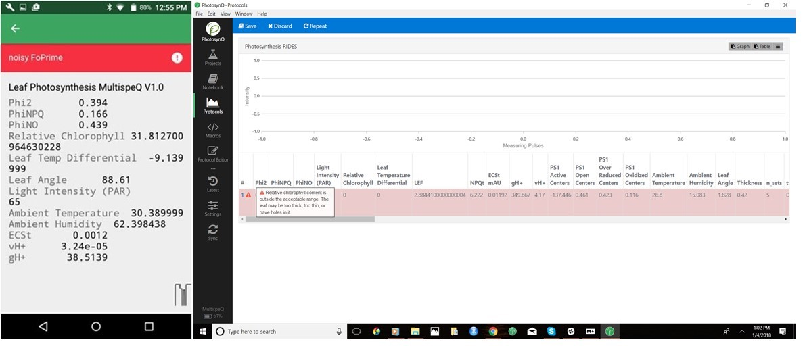

# Data Quality
{docsify-readtime}
#### Identifying Measurements with Issues

As we explained in the [Data Collection](tutorials/data-collection?id=submitting-quality-measurements) tutorial, the best way to keep your data set clean is to discard low quality measurements before they get submitted to PhotosynQ. To help users filter out bad measurements, we have added a series of issue warnings to the default *Leaf Photosynthesis MultispeQ v1.0* and *Photosynthesis RIDES* protocols. These issue warnings are displayed in **red** on the results screen of both the android and desktop apps. We recommend that users discard measurements with warning message's, unless they are certain the measurement is accurate. If a poor quality measurement does get submitted to the website you will be able to **Flag** the data in the data explorer (see below).

?> **Tip:** The *Leaf Photosynthesis MultispeQ v1.0* protocol also has **yellow** issue warnings as well. These are for information only and you should NOT discard measurements for yellow warnings unless you are sure the measurements is bad.

#### Common reasons for poor quality measurements

1. The device or leaf was not held steady throughout the measurement. This can be due to taking measurements in windy conditions or the data collector's hand shaking.
2. The leaf did not fully cover the light guide. This is especially problematic for absorbance measurements such as relative chlorophyll content. This often results in an issue warning stating that the relative chlorophyll content is either very low or out of the expected range.
3. The leaf was dead or dying. Leaves in this condition can cause the Phi2, PhiNPQ or PhiNO values to be out of the expected range. This may be a completely valid measurement, or a measurement that should be discarded.

#### How to identify data with 'issues' in the data explorer?

1. We have added a default panel on the dashboard labelled **Data Quality - Issues** that provides information about how many of the *non-flagged* measurements have issue warnings. If the panel is not visible, you can add it to your dashboard by:

	a. Select **Add Panel** in the dashboard
	b. Select the **data quality** tab
	c. Select the **Show Issues** button below **Data Issues**

!> **Note:** Only *non-flagged* measurements with issues will be displayed on the dashboard.

2. In the **Spreadsheet** view, there is an **Issues** column that will display how many issues exist for a given measurement (left).

3. In the single datum view, any issues will be present as a red bar above the measurement results (right).

#### Flagging data
If you submit data with issues to the website, you will still have the opportunity to remove those measurements from future data viewing and analysis. This is accomplished by **Flagging** the measurements that have issues. **Flagging** hides measurements, so that they are not added to filtered series or downloaded as a csv for data analysis. However, flagging data **DOES NOT** delete the measurements from the website. Flagged data can always be viewed by clicking the **Include flagged datasets** box in the **Add Series** tab.

You can flag any measurement, for any reason. However, you have to provide a reason for flagging data, which will be visible to the community. Our hope is that data is only flagged for significant issues, such as the measurement issues mentioned above or because a measurement was mislabeled, etc, and not simply because the measurement is an outlier.

#### Who can flag Project measurements
Within a given Project, the only people who can flag a measurement are:

- The Project lead
- Anyone who has administrative rights for that Project
- The individual who collected the measurement of interest

#### How to flag a measurement
Once you have identified the measurement that you wish to flag you need to:

1. Open the single datum view for that measurement by either selecting the datum id in the spreadsheet view or by clicking on the measurement in the plotting tool or map.
2. Select the **Issues** tab on the right side of the screen.
a. If you have permission to flag that measurement, a text box will appear under the heading **Reason for flagging**.
b. If you do not have permission to flag that measurement, you will get a message stating: *Click here to report data issues in the Project discussion forum*.
3. Enter the reason for flagging the measurement into the text box.
4. Click **Submit**

