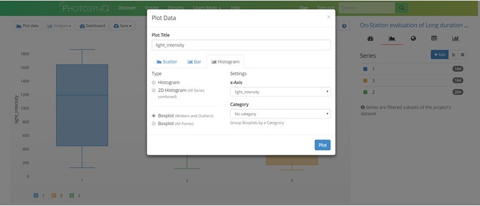
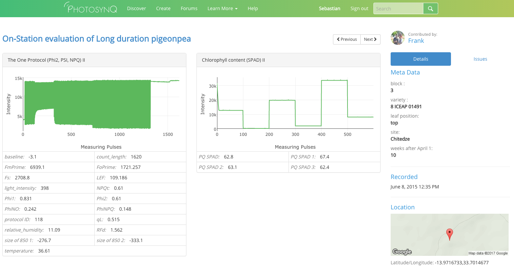

# Project Dashboard
{docsify-readtime}
As soon as you have uploaded your data from the mobile or desktop app to the website you check it out on the **Data Viewer**.

1. Go to your Project page and click on **View Data** from the left side menu. 
2. Wait for your data to load. This can take anywhere from a couple of seconds to a couple of minutes depending on the number of measurements in the Project and the speed of your internet connection.
3. Once your Project data has loaded you will land on your Project's **Dashboard**.

From the **Dashboard** you can choose to graph your data, view it on a map, view it as a spreadsheet, or conduct some simple statistical tests by clicking on the appropriate icon (see below).

 

***

### Filter Your Data

Looking at all of your data together may not be very informative. You can **Filter** your data to create separate **Series** that you can compare.

To start generating **Series**

1. Select **+ Add** from the right site menu to show the filter dialog.
2. Expand the Project Question or other category that you want to filter by.
3. Select your answer or answers for each Question.
4. Choose whether you want to make a single series or multiple series
   - To add a single Series
     1. Make your filter selections.
     2. Select **+ Add** below the available filter options to create one series

   

   - To add multiple Series
     1. Make your filter selections.
     2. Select **<i class="fa fa-caret-up" aria-hidden="true"></i>** and choose **Import as separate series**.

   

***

### Graph Data

1. Click on the graph creator icon in the data viewer. 
2. Select the kind of graph that you want to create from the dialog box. You can choose between a variety of scatter, bar, and histogram charts.
3. Use the drop down menu's to choose which parameters you wish to graph.
4. After you have chosen the parameters to graph, select **Plot**.

?> **Tip:** The most important parameters will be listed as **Primary Parameters** and **Project Questions**. If the parameter you are looking for is not in these two categories, scroll to the bottom of the drop down menu and look under **Advanced**.

For more help with plotting data, please visit the [Help Center](view-and-analyze-data/data-plot-data).

***

### Map Data

To view your measurements on a map or generate a heat-map select the **Map** icon from the dashboard.

You can view your data overlaid on a satellite map or regular map and you can zoom in or out. You can also create a heat-map by selecting the parameter of interest in the upper left hand corner of the map.

***

### Data Spreadsheet

You can view your data as a spreadsheet by clicking on the **Spreadsheet** icon from the dashboard.

You have several options within the spreadsheet view:

1. Download the entire table as a `csv` or `text` file by selecting the **Save** dropdown menu.
2. Add more information to the table, including the Device ID, Latitude and Longitude, etc from the **More** menu.
3. Select which protocol you want to view from the **Protocols** menu. This only applies to Projects with more that one measurement protocol.

### Single Measurements

In order to access a single measurement, you have multiple options:

1. Click on a marker in a scatter plot.
2. Click on a map marker and select [View Measurement] from the popup.
3. Click on an ID number in the ID column of the spreadsheet.

?> **Tip:** Viewing a single measurement allows you to verify a measurement and flag if necessary to indicate an insufficient quality, labeling error, etc.