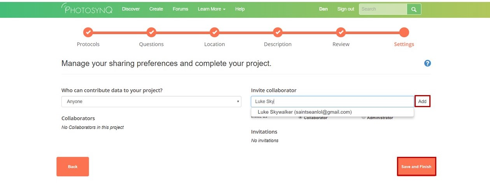

### Project Invitations
You can invite collaborators to your projects and others can invite you to collaborate on their projects.

#### Invite a Collaborator to Your Project
You can invite collaborators to join your project either when you are creating a project, or invite them to an already created project.

To invite collaborators while creating a project:
1. In the **Settings** tab, select **Collaborators only** from the "Who can contribute data to your project" drop down menu
2. Enter the email address of the collaborator you are inviting in the **Invite collaborator** box
3. After typing in the email adress, click the **Add** button. You can invite as many collaborators has you want, and you can choose if you want them to be a collaborator (meaning they can contribute data) or an administrator (meaning they can edit you project)
4. Once you have finished inviting collaborators, click **Save and Finish** from the bottom of the page

Inviting collaborators to an exisiting project:
1. Go to the project homepage on https://photosynq.org
2. Click on the **Options** menu. The options menu will only be visible if you are the project administrator
3. Select **Settings**
4. Follow steps 1-4 above to invite collaborators

***Tip:*** If you have selected the **Anyone** option from the "Who can contribute data to your project" menu, then you do not need to send an invitation to collaborators. Instead they can **join** the project from the project homepage by clicking the **Join Team** button.

#### Accept Invitations
1. Open your user page by clicking on your name in the top **Menu**.
2. On the left hand side click on **Invitations**. The little badge indicates if there are new invites.
3. Check your list of available invitations and click on **Join** if you want to collaborate.

***Note:*** You will receive an email as well. Click on the link inside the email to join the Project.

***Tip:*** Below the project name it is indicated if you are invited as a **Collaborator** or **Administrator**.

#### Decline Invitations
1. Open your user page by clicking on your name in the top **Menu**.
2. On the left hand side click on **Invitations**. The little badge indicates if there are new invites.
3. Check your list of available invitations and click on **Decline Invitation** if you don't want to collaborate on this project.
