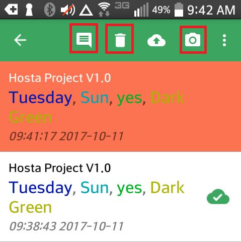
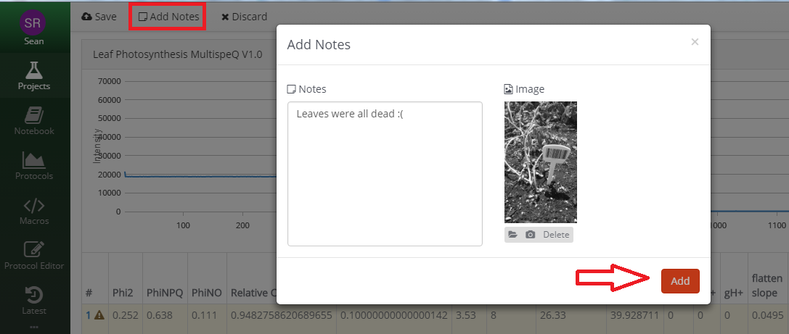

### Adding Notes and Pictures

Whether you are in the field using the mobile app, or you are taking measurements with the desktop app, after every measurement you can attach a note and/or picture that will be viewable online.

#### Mobile App

In the mobile app, you can add notes or pictures to measurements AFTER you have accepted the measurement but BEFORE the measurement has been submitted to the website. Important note: If the measurement has a green check next to it, it has been submitted to the website and cannot be modified.

To modify a measurement:

1. Go to the Measurements screen on your Mobile App. Press and hold the measurement(s) you want to modify.
2. To delete the measurement, select the *Trash* icon.
3. To add a note, select the *Note* icon from the menu at the top of the screen, type the note into the text-box and select **Save Note**.
4. To add a picture, select the *Camera* icon from the menu at the top of the screen, take the picture and select **OK**

***Note: if you go back and add another note, it will overwrite your last note with the new note.***

#### Desktop App

In the Desktop App, notes and pictures can only be added BEFORE you save the measurement to the PhotosynQ platform. When you save measurements to the notebook, notes and pictures can be saved with the measurement at any time.

1. Select **Add Notes** from the menu at the top of the page
2. Type in a note, use the computer's camera to take a picture, or upload an image from your computer.
3. Once you have added all of your notes and images, select **Add**.

