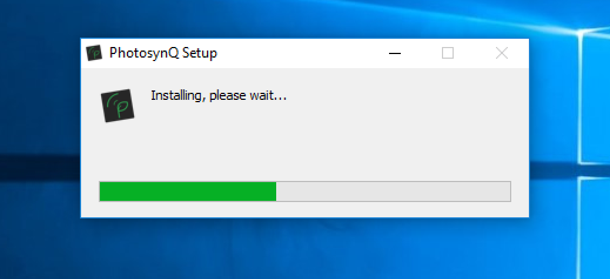

### PhotosynQ for Desktops

Taking measurements in the in the lab, developing new measurement protocols and macros? The desktop allows you to do that, amongst many other more bench top related tasks.

#### Download the PhotosynQ app

1. Go to <https://photosynq.org/software> and scroll to the **Desktop App**.
2. Download the app for your operating system.

#### Installation

##### Windows

1. Navigate to the file you just downloaded.
2. Double click on the executable file to start the installation.
3. The app gets installed into the default windows application folder (e.g. `C:\Program Files`).
4. A short-cut is added to the Desktop.

##### Mac

1. Navigate to the file you just downloaded.
2. Double click the file to open the disk-image.
3. Drag 'n drop the app icon onto the application icon.

#### Updates

Updates are downloaded and installed automatically to make sure, you always have the latest version of the app.

#### Troubleshooting

Sometimes the app does not work as expected. Please try this first:

- [x] Make sure you have the latest version of the app.
- [x] Make sure you have sufficient storage.
- [x] Make sure you have an internet connection.
- [x] Restart the device before installing.