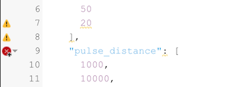
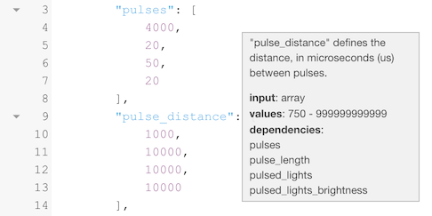

### Desktop Protocols

Protocols are programming the instrument to run a measurement. To work with Protocols you can select **Protocols** from the left side bar, you can select **View -> Protocols** from the top menu bar or you can use the shortcut `Ctrl+3 / ⌘3`.

**My Protocols** shows a list of Protocols you have created. **Explore** will provide a list of all Protocols currently available on the Platform. Click on the list headers to sort the list of Macros by name, creator and date.

A **single click** on a Protocol from the list will bring up details about the Macro in the right side bar. Here you can also see the discussion around the macro as well as add new comments. A **double click** will directly run the Protocol.

Select the search field in the top right corner `Ctrl+F / ⌘F` to enter a search query followed by the enter key to search the list of Protocols. Use the `×` button inside the input field or the `Esc` key to reset the search.

#### Run a Protocol

To run a Protocol, you can select a protocol from the list with a **single click**. In the side bar click on the **Run** button to start the measurement. You can also simply run a Protocol right from the list with a **double click**.

#### Create a new Protocol

You can create a new Macro by opening the Macro editor selecting **File -> New Protocol** from the main menu or use the shortcut `Ctrl+5 / ⌘5`. The macro template will be automatically added to your Code Editor and you are ask to pick a measurement from your Notebook to use as your measurement template. You can select that measurement at any time selecting **Measurement** from the **Menu Bar**, but it is easier to start with a measurement provided.

#### Editing an existing Protocol

You can edit a Macro simply by selecting a macro from the list of macros and open the editor by double clicking it or you can use the edit button in the right side bar to open the Macro Editor.

When you are the creator of the Macro you can either overwrite the existing Macro or you can save it as a new Macro. In case you are not the creator, you can only save the macro as a new one.

#### The Protocol Editor

The **Protocol Editor** allows you to build new Protocols or modify existing ones. The Protocol then can be connected to a Macro to calculate parameters from the recorded measurement results.

#### Table View

The Protocol structure can get complicated, especially if you have very long pulse sets. The **Table View** will make it easier to keep track of those settings. If you are using protocol sets, the Table View will not work and you have to use the Advanced View.

#### Advanced View

The **Advanced View** allows to edit the Protocol code directly.

When you have an Instrument connect, you will also get the commands for LEDs, Detectors and Miscellaneous Sensors.

