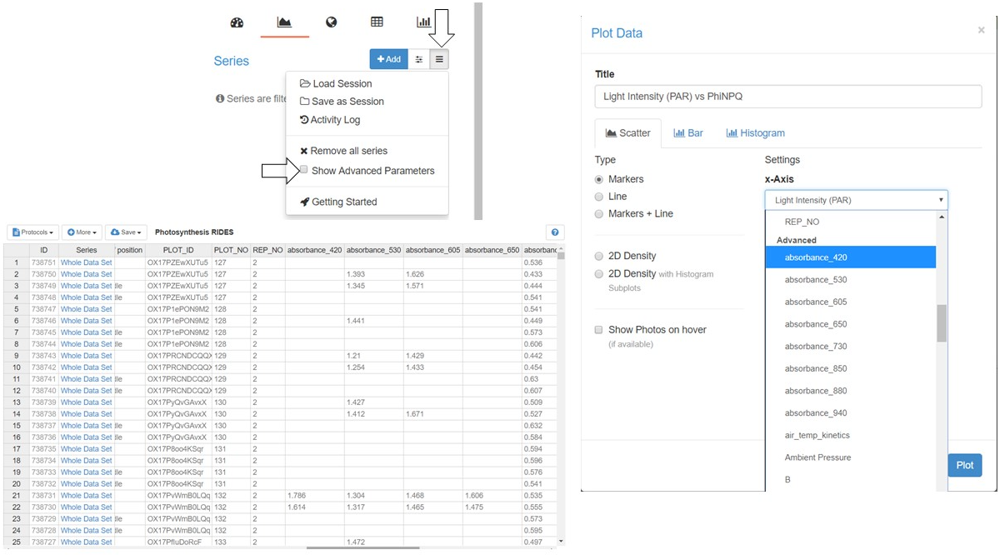

### Advanced Parameters

Most measurement Protocols will output a large set of parameters derived from the recorded traces and sensors. Most Users might not need all of these Parameters in their data analysis. In order to make the analysis using the **Data Viewer** more accessible, you can hide those **Advanced Parameters** and only show the more frequently used **Primary Parameters**. Some Protocols don't have their Parameters separated, in which case they are all considered **Primary Parameters**.

***Note:*** By default, **Advanced Parameters** are hidden.

#### Show/Hide Parameters

If you want to show or hide the **Advanced Parameters**, simply select the menu <i class="fa fa-bars" aria-hidden="true"></i> in the data viewer and check/un-check the checkbox for **Show Advanced Parameters**. Parameters will be shown/hidden from all dropdown menus, including the dashboard, plotting, map and statistics as well as all columns in the spreadsheet.

***Note:*** In case an **Advanced Parameters** is used for a graph and saved to the dashboard, the **Advanced Parameters** will be shown by default.

#### Creating Macros

In case you are creating a Macro for a Protocol, you can use the `order` key ([more](/macros_Coding_and_Functions)), to provide an array with **Primary Parameters**. Macros without this key/value pair will only output **Primary Parameters**.