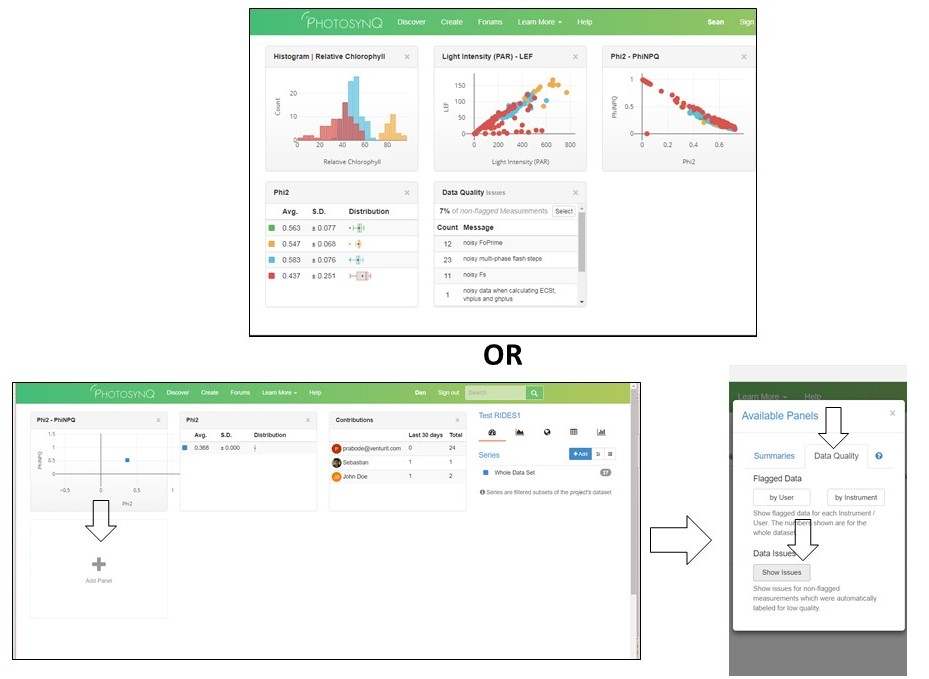
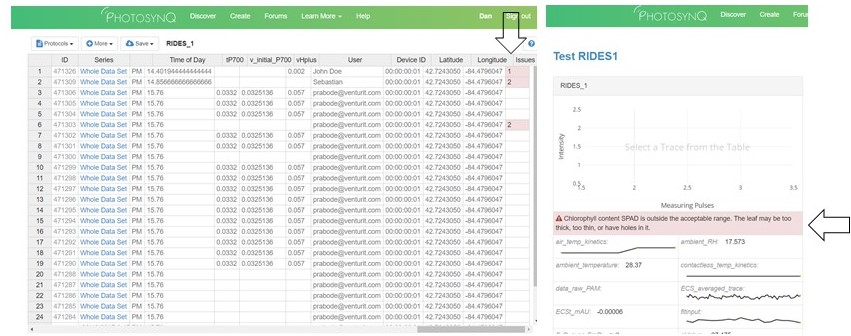

### Data Issues


We have programmed issue warnings into the default *Leaf Photosynthesis MultispeQ v1.0* and *Photosynthesis RIDES* protocols. We recommend that users discard measurements with **red** warning message's, unless they are certain the measurement is accurate. Users may also program issue warnings into their own macro's for quality control. 

***Tip:*** The *Leaf Photosynthesis MultispeQ v1.0* protocol also has **yellow** issue warnings. These are for information only and should NOT be discarded unless you are certain the measurement is bad.


#### Common causes of issue warnings

1. The device or leaf was not held steady throughout the measurement. This can be due to taking measurements in windy conditions or the data collector's hand shaking.
2. The leaf did not fully cover the light guide. This is especially problematic for absorbance measurements such as relative chlorophyll content. This often results in a warning message stating that the relative chlorophyll content is either very low or out of the expected range.
3. The leaf was dead or dying. Leaves in this condition can cause the Phi2, PhiNPQ or PhiNO values to be out of the expected range. This may be a completely valid measurement, or a measurement that should be discarded.

#### Identify measurements with issue warnings in the data explorer?

1. We have added a default panel on the dashboard labelled **Data Quality - Issues** that provides information about how many of the *non-flagged* measurements have issues. If the panel is not visible, you can add it to your dashboard by:

	a. Select **Add Panel** in the dashboard
	
	b. Select the **data quality** tab
	
	c. Select the **Show Issues** button below **Data Issues**

***Note:*** Only *non-flagged* measurements with issues will be displayed on the dashboard. Once you have flagged a measurement, it is hidden from normal data viewing and analysis unless you check the **Include flagged datasets** box in the **Add Series** tab



2. In the **Spreadsheet** view, there is an **Issues** column that will display how many issues exist for a given measurement.

3. In the single datum view, any issues will be present as a red bar above the measurement results.




#### Adding issue warnings to Macros
Anyone can add isse warnings to their own macro's by following the code structure below.

#### Code Structure
Here is an example of how we added issue warnings to the **Photosynthesis RIDES** protocol for when Phi was out of the expected range (0 - 0.85).

```javascript
  if (fvfm <= 0) {
	danger("Phi2 is outside of expected range, please consider discarding the measurement",output);
  }
  if (fvfm >=.85) {
	danger("Phi2 is outside of expected range, please consider discarding the measurement", output);
  }
  else {
	  output["Phi2"] 		= MathROUND(fvfm,3);
  }
```
