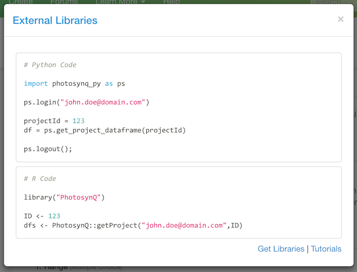

### Download `beta`

While the data viewer allows you to analyze the collected measurements for a Project, it might become necessary to download the dataset and work in a different software. There are multiple ways to access the data. You can:

1. Download a filtered dataset as a `.csv` from the spreadsheet in the data viewer
2. Download the complete dataset from the Project page as a spreadsheet (.xlsx)
3. Download the data as a `JSON` formatted file (.json)
4. Use the Python or R libraries (external libraries) to import the Project dataset as a data-frame

***Note:*** We are strongly recommending to view your data in the data viewer and flag data if necessary, before downloading the dataset. This will ensure the highest quality and best results for your subsequent analysis.

#### Availability

Downloads are *not* available to everyone. You have to be signed in and either a Project lead or a Project contributor, to have access to those files.


#### Data Viewer

When you are viewing the Project data using the data viewer, you can save your current selection in the spreadsheet as a `.csv`. See more in the section [The Spreadsheet](./help/data_The_Spreadsheet).

#### Spreadsheet

The spreadsheet is structured the same way, it is in the data viewer. If you use multiple protocols, you will have multiple sheets. Each sheet will have the name of the protocol.


#### JSON

When you download the data as a `JSON` you will receive it with more information than the spreadsheet. Yet, it is not the original dataset, but the processed, meaning, certain fields, like the `raw trace`. If you require this data, please use one of the external libraries.

```Javascript
[
    {
        "api_version": "3",             // Used API version
        "app_device": "x86-64",         // Device to record measurement
        "app_name": "PhotosynQ",        // App name
        "app_os": "mac",                // App OS
        "app_version": "0.3.2",         // App version
        "custom": {                     // Custom data (if imported)
            ...
        },
        "datum_id": 271164,             // Unique data point ID
        "datum_url": "https://...",     // Link to measurement
        "device_id": "82",              // Instrument ID
        "firmware_version": "0.47",     // Instrument firmware version
        "location": [                   // Attached location
            42.7369792,                 // longitude
            -84.4838654                 // latitude
        ],
        "status": "submitted",          // Measurement status (submitted/flagged)
        "time": 1463001730187,          // Unix timestamp in ms (UTC)
        "time_offset": 240,             // timezone offset in min (optional)
        "user_answers": {               // user answers to Project Questions
            "11292": "red"
        },
        "user_id": 7,                   // User ID (took measurement)
        "sample": [                     // Results from measurement protocol
            {
                "time": 1463001730225,  // Unix timestamp in ms (UTC)
                "protocol_id": "475",   // Protocol ID
                ...
            },
            ...
        ]
    },
    ...
]
```

#### External libraries

Just select **External Libraries** from the download options on the Project page. This will bring up a modal dialog with code examples for **Python** and **R**. Simply copy the code into your script to generate a data-frame.



More on how to use the libraries, see the link to the [software](https://photosynq.org/software#analysis) page and [tutorials](https://photosynq.org/tutorials/analysis) at the bottom of the dialog.