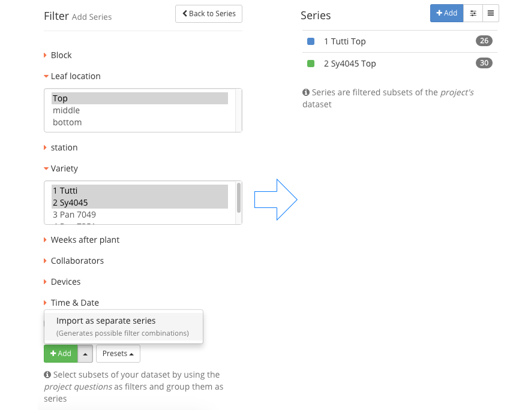

#### Filter data

You can filter your data by **Project Questions**, **Users**, **Devices** and **Time** or combinations of those. These subsets are called **Series**.

#### Apply Filters

1. Select **+ Add** to show the filter dialog.
2. Expand Project Question or Questions you want to filter by.
3. Select your answer or answers for each Question.

***Tip:*** See the examples on how the series are generated.

#### Add a single Series

1. Make your filter selections.
2. Select **+ Add** below the available filter options to create one series.

#### Add multiple Series

1. Make your filter selections.
2. Select **<i class="fa fa-caret-up" aria-hidden="true"></i>** and choose **Import as separate series**.

#### Presets

Instead of selecting filters you can simply click on presets and select one of the available options to generate the corresponding  **Series**.

#### Example

Adding a single or multiple **Series** has a different logic in which filters are applied

##### **Single Series:*

All of the measurements that include any of the selected filters will be contained in **one series.**

##### **Multiple Series:**

This selection will generate a separate series for each unique combination of filters.

