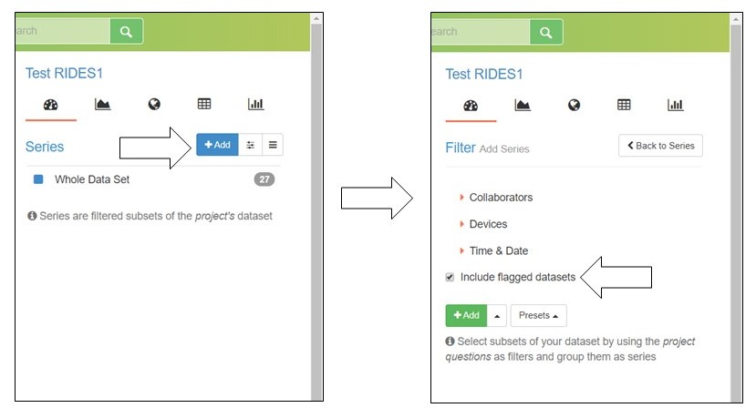
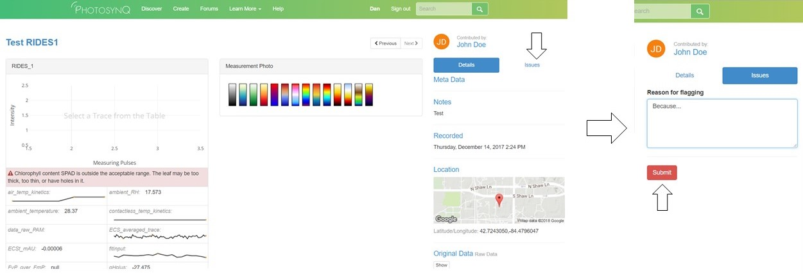

### Flagging measurements

Sometimes it is necessary to remove measurements from a Project before you can properly analyze data. For example, you may need to remove poor quality measurements or measurements that were mislabeled in the field. Measurements can be removed from filtered series and csv download by **Flagging**. Flagging data **DOES NOT** delete the measurements from the website. Flagged data can always be viewed by clicking the **Include flagged datasets** box in the **Add Series** tab.

You can flag any measurement, for any reason. However, you have to provide a reason for flagging data, which will be visible to the community. Our hope is that data is only flagged for significant issues, such as the reasons mentioned above and not simply because the measurement is an outlier.

#### Who can flag Project measurements

Within a given Project, the only people who can flag a measurement are:

- The Project lead
- Anyone who has [administrative rights](https://photosynq.org/help/projects_Managing_Project_Settings) for the Project
- The individual who collected the measurement of interest

#### How to flag a measurement

Once you have identified the measurement that you wish to flag you need to:

1. Open the single datum view for that measurement by either selecting the datum id in the spreadsheet view or by clicking on the measurement in the plotting tool or map.
2. Select the **Issues** tab on the right side of the screen.
    - If you have permission to flag that measurement, a text box will appear under the heading **Reason for flagging**.
    - If you do not have permission to flag that measurement, you will get a message stating: *Click here to report data issues in the Project discussion forum*.
3. Enter the reason for flagging the measurement into the text box.
4. Click **Submit**

