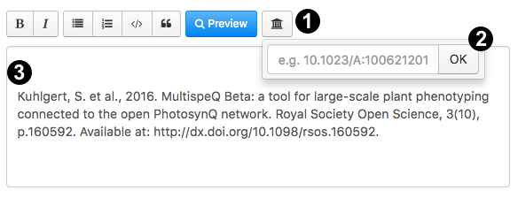

### How to Cite

**Congratulations on the progress you made in your research efforts!** We would like to give you some guidance on how to cite when you are writing up your findings, write up a description for a Protocol/Macro or starting a discussion using the PhotosynQ platform. Adding the proper citations will make it easier for your readers to gain a deeper understanding, follow your line of arguments... and it also is *good scientific practice*!

#### Inserting Citations on PhotosynQ

We would like to make it as easy as possible for you to insert citations into your Project description, your Project results, even in Protocol or Macro descriptions and Forum posts. You will find next to the text formatting tools a <i class="fa fa-university"></i> Library icon. Click on the button (1) and add the DOI number of your reference (2). The reference including a link (3) will be added at the cursor position in the text.

***

#### Using an Instrument

When you were using a MultispeQ and the PhotosynQ platform, please don't forget to cite us using the folowing reference:

Kuhlgert, S., Austic, G., Zegarac, R. Osei-Bonsu, I.,Hoh, D., Chilvers, M. I., et al. (2016). **MultispeQ Beta: a tool for large-scale plant phenotyping connected to the open PhotosynQ network.** *R. Soc. Open Sci.* 3, 160592. [doi:10.1098/rsos.160592].

#### Reviews

For a general purpose overview of fluorescence- and absorbance-based photosynthetic parameters, and their interpretation, we recommend the following sources:

Kramer, D.M., Cruz, J.A. and Kanazawa, A. (2003) **Balancing the central roles of the thylakoid proton gradient.** *Trends Plant Sci.* 8: 27-32 [doi:10.1016/S1360-1385(02)00010-9]

Baker, N.R., Harbinson, J., and Kramer, D.M. (2007) **Determining the limitations and regulation of photosynthetic energy transduction in leaves.** *Plant Cell Environ.* 30: 1107-1125 [doi:10.1111/j.1365-3040.2007.01680.x]

Baker, N.R. (2008) **Chlorophyll fluorescence: A probe of photosynthesis in vivo.** *Annu. Rev. Plant Biol.* 59: 89-113 [doi:10.1146/annurev.arplant.59.032607.092759]

#### Parameters

The MultispeQ can measure a whole variety of fluorescence and absorbance based parameters as well as environmental parameters. You can find a list with the most common ones [here](instruments_What_does_the_MultispeQ_measure).

#### Fluorecence Based Parameters

##### Phi2 - Photosystem II Quantum yield

Genty, B., Briantais, J.-M. & Baker, N.R. (1989). **The relationship between the quantum yield of photosynthetic electron transport and quenching of chlorophyll fluorescence** *Biochimica et Biophysica Acta (BBA) - General Subjects* 990(1), pp.87–92. [doi:10.1016/S0304-4165(89)80016-9].

##### PhiNPQ / PhiNO

Kuhlgert, S., Austic, G., Zegarac, R. Osei-Bonsu, I.,Hoh, D., Chilvers, M. I., et al. (2016). **MultispeQ Beta: a tool for large-scale plant phenotyping connected to the open PhotosynQ network.** *R. Soc. Open Sci.* 3, 160592. [doi:10.1098/rsos.160592].

##### NPQ(T) - Non Photochemical Quentching

Tietz, S., Hall, C. C., Cruz, J. A., Kramer, D. M. (2017) **NPQ(T): a chlorophyll fluorescence parameter for rapid estimation and imaging of non-photochemical quenching of excitons in photosystem-II-associated antenna complexes** *Plant. Cell Environ.* 40(8), 1243–1255. [doi:10.1111/pce.12924].

##### qL - Fraction of PSII centers that are "open"

Kramer, D.M., Johnson, G., Kiirats, O., and Edwards, G.E. (2004) **New fluorescence parameters for the determination of QA redox state and excitation energy fluxes.** *Photosynth. Res.* 79: 209-218 [doi:10.1023/B:PRES.0000015391.99477.0d]

***

#### Absorbance Based Parameters

##### vH⁺ - Proton conductivity

Avenson, T. J., Kanazawa, A., Cruz, J. A., Takizawa, K., Ettinger, W.E., Kramer, D. K. (2005). **Integrating the proton circuit into photosynthesis: progress and challenges.** *Plant Cell Environ.* 28: 97-109. [doi:10.1111/j.1365-3040.2005.01294.x].

##### ECSt - Magnitutue of Electrochromic Shift

Sacksteder, C. A., Kanazawa, A., Jacoby, M. E., Kramer, D. M. (2000). **The proton to electron stoichiometry of steady-state photosynthesis in living plants: A proton-pumping Q cycle is continuously engaged.** *Proc. Nat. Acad. Sci.* 97, 14283-14288. [doi:10.1073/pnas.97.26.14283]

Kramer, D. M., Sacksteder, C. A., Cruz, J. A. (1999). **How acidic is the lumen?** *Photosynthesis Res.* 60: 151-163 [doi:10.1023/A:1006212014787]

Cruz, J.A., Sacksteder, C.A., Kanazawa, A., and Kramer, D.M. (2001) **Contribution of electric field (delta psi) to steady-state transthylakoid proton motive force (pmf) in vitro and in vivo. Control of pmf parsing into delta psi and delta pH by ionic strength.** *Biochemistry* 40: 1226-1237 [doi:10.1021/bi0018741]

##### gH⁺ - Steady-State Proton Flux

Kanazawa, A., Kramer, D. K. (2002). ***In vivo* modulation of nonphotochemical exciton quenching (NPQ) by regulation of the chloroplast ATP synthase.** *Proc. Nat. Acad. Sci.* 99: 12789-12794. [doi:10.1073/pnas.182427499]

##### Phi1 - Photosystem I Center State

Harbinson, J., and Hedley, C.L., (1989) **The kinetics of P-700+ reduction in leaves: a novel in situ probe of thylakoid functioning.** *Plant, Cell. Environ.* 12: 357-369 [doi:10.1111/j.1365-3040.1989.tb01952.x]

Kanazawa, A., Ostendorf, E., Kohzuma, K., Hoh, D., Strand, D. D., Sato-Cruz, M., Savage, L., Cruz, J. A., Fisher, N., Froehlich, J. E., Kramer, D. K. (2017). **Chloroplast ATP Synthase Modulation of the Thylakoid Proton Motive Force: Implications for Photosystem I and Photosystem II Photoprotection.** *Front. Plant Sci.* 8:1-12. [doi:10.3389/fpls.2017.00719].

##### SPAD - Special Products Analysis Division

Maas, S.J. & Dunlap, J.R. (1989). **Reflectance, Transmittance, and Absorptance of Light by Normal, Etiolated, and Albino Corn Leaves.** *Agronomy Journal*, 81(1), p.105. [doi:10.2134/agronj1989.00021962008100010019x]

#### Links

If you want to add a link to the platform, please use: <https://photosynq.org>

Also we would like to strongly encourage you to share the link(s) to your projects so others can see the data you have collected. This goes hand in hand with writing a short result section on the platform, perhaps including a link to your publication...

[doi:10.1016/S0304-4165(89)80016-9]: https://doi.org/10.1016/S0304-4165(89)80016-9

[doi:10.1016/S1360-1385(02)00010-9]: https://doi.org/10.1016/S1360-1385(02)00010-9

[doi:j.1365-3040.2007.01680.x]: https://doi.org/10.1111/j.1365-3040.2007.01680.x

[doi:10.1146/annurev.arplant.59.032607.092759]: https:/doi.org/10.1146/annurev.arplant.59.032607.092759

[doi:10.1023/B:PRES.0000015391.99477.0d]: https://doi.org/10.1023/B:PRES.0000015391.99477.0d

[doi:10.1111/pce.12924]: https://doi.org/10.1111/pce.12924

[doi:0.1111/j.1365-3040.1989.tb01952.x]: https://doi.org/doi:0.1111/j.1365-3040.1989.tb01952.x

[doi:10.1098/rsos.160592]: https://doi.org/10.1098/rsos.160592

[doi:10.1073/pnas.97.26.14283]: https://doi.org/10.1073/pnas.97.26.14283

[doi:10.1023/A:1006212014787]: https://doi.org/10.1023/A:1006212014787

[doi:10.1021/bi0018741]: https://doi.org/10.1021/bi0018741

[doi:10.1111/j.1365-3040.2005.01294.x]: https://doi.org/10.1111/j.1365-3040.2005.01294.x

[doi:10.1073/pnas.182427499]: https://doi.org/10.1073/pnas.182427499

[doi:10.1111/j.1365-3040.1989.tb01952.x]: https://doi.org/10.1111/j.1365-3040.1989.tb01952.x

[doi:10.2134/agronj1989.00021962008100010019x]: https://doi.org/10.2134/agronj1989.00021962008100010019x