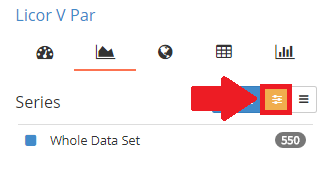

### Set Thresholds
You can set ranges for individual *numeric* **Parameters**, allowing you to exclude outliers or focus on specific ranges of values. Thresholds for multiple ***Parameters*** can be defined at the same time.

#### View Thresholds
1. On the right hand side, just select the <i class="fa fa-sliders"></i> thresholds tab.

#### Add Thresholds
1. Select **Add** to add a new Threshold

2. Choose the **Parameter** and set the range.
3. Add more Thresholds if you like.
4. Select **Apply** to reflect the thresholds in your views, except for the spreadsheet view.

***Tip:*** Thresholds are applied only for the duration of a session, unlike flagged data. This allows you to exclude outliers, especially when you are not the project administrator or lead.

#### Remove Thresholds
1. Click on **&times;** to remove the corresponding threshold.
2. Select **Apply** to reflect the changes in your views, except for the spreadsheet view.
