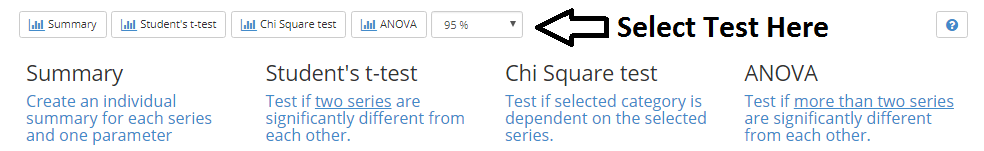

### Statistics

A very basic set of statistical tools for your project data analysis.

#### View the Spreadsheet

1. Select the **<i class="fa fa-bar-chart"></i> Statistics** from the right menu underneath the Project name.
2. Choose the type of statistics you wish to perform and select the signficance level.

***

#### Summary

1. Pick the parameter you want the statistical summary generated for and click on **Show Summary**.

#### Student's t-test

1. Pick the parameter and the two series you want to compare.
2. Select one-tailed or two-tailed, depending on your dataset.
3. Click on **Run t-test** to show the results.

#### ANOVA

1. Pick the parameter and at least two series to compare.
2. Check **Create correlation matrix** to generate a table of t-test.
3. Click **Run ANOVA**.

#### Chi Square test

1. Pick the parameter that you want to test for.

    ***Note*** the parameter must be a categorical variable.

2. Pick at least 2 series to compare.
3. Click **Run Chi Square test**.