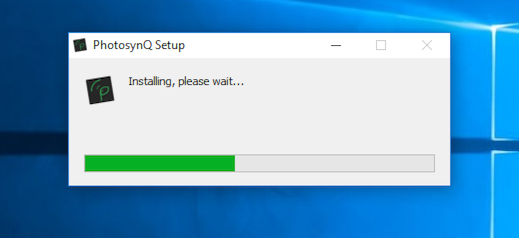

### Installation - Desktop

Taking measurements in the in the lab, developing new measurement protocols and macros? The desktop allows you to do that, amongst many other more bench top related tasks.

#### Download the PhotosynQ app

1. Go to [https://photosynq.org/software](https://photosynq.org/software/#desktop) and scroll to the **Desktop App**.
2. Download the app for your operating system.

#### Installation

##### Windows

1. Navigate to the file you just downloaded.
2. Double click on the executable file to start the installation.
3. The app gets installed into the default windows application folder (e.g. `C:\Program Files`).
4. A short-cut is added to the Desktop.

##### Mac

1. Navigate to the file you just downloaded.
2. Double click the file to open the disk-image.
3. Drag 'n drop the app icon onto the application icon.

##### Linux

***Note:*** Right now there is no version available. If you are interested in helping us testing, please send a request to <support@photosynq.org>.

#### Starting the app for the first time

When you are starting the app for the first time you will be asked for your login credentials. If you don't already have an account, please follow the **sign up** link in the login dialog to create an account. After that use the login credentials to sign in to the app.

Further you will be asked if you want to activate the location services. The location is used together with measurements in projects. You can activate or deactivate the services at any time in the [application settings].

***Note:*** MacOS users will be asked if they want to give the application access to their keychain. Please select **Always** to allow the PhotosynQ app to safely store the login information to the keychain.

#### Updates

Updates are downloaded and installed automatically to make sure, you always have the latest version of the app.

***Tip:*** You can activate / deactivate the automatic updates in the [application settings] at any time.

#### Troubleshooting

Sometimes the app does not work as expected. Please try this first:

- Make sure you have the latest version of the app.
- Make sure you have sufficient storage.
- Make sure you have an internet connection.
- Restart the device before installing.

[application settings]: ./desktop/_desktop_app_Settings