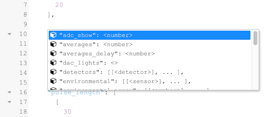

### The Protocol Editor - Desktop

The **Protocol Editor** allows you to build new Protocols or modify existing ones. The Protocol then can be connected to a Macro to calculate parameters from the recorded measurement results.

#### Table View

The Protocol structure can get complicated, especially if you have very long pulse sets. The **Table View** will make it easier to keep track of those settings. If you are using protocol sets, the Table View will not work and you have to use the Advanced View.

#### Advanced View

The **Advanced View** allows to edit the Protocol code directly.

When you have an Instrument connect, you will also get the commands for LEDs, Detectors and Miscellaneous Sensors.

