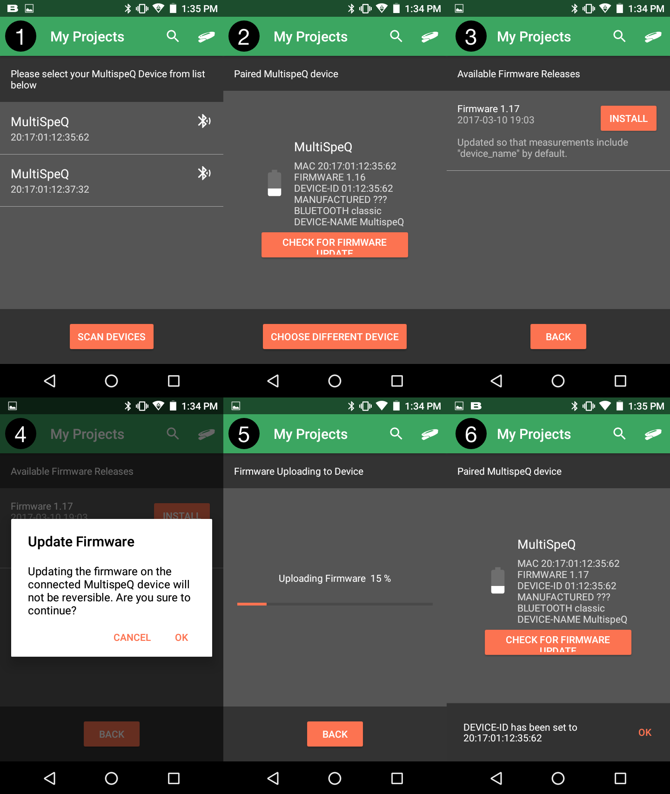

## How to Install Firmware Updates

Normally, the PhotosynQ apps automatically notify you when there is a new firmware version available for your instrument. In this case you can follow the instructions, and the apps will download the correct version and install it on your instrument.

***Note:*** We do not recommend that anyone uploads any other versions of the firmware or from unknown sources, unless you know what you are doing!

### Automatic Firmware Update

When you connect to an instrument using the mobile app or the desktop app, you will be notified, if there is a firmware update available. Firmware updates usually provide fixes as well as new features. Some new measurement protocols might require the latest firmware, so we strongly recommend to install the updates. Below you find instructions on how to install those updates using the Mobile App (Android) or the Desktop App.

***

### Mobile App (Android)

#### Step 1

Make sure Bluetooth is enabled on your phone/tablet and select your instrument from the list. In case the instrument is not showing up, use the **"Scan Devices"** button to update the list.

#### Step 2

After connecting your instrument select **"Check for Firmware Update"** to check for updates. Make sure, you have an active internet connection.

#### Step 3

If an update is available for your instrument, select **"Install"** to install the firmware update on your instrument. The version number of the update as well as the changes are displayed.

#### Step 4

Confirm that you want to install the firmware update.

#### Step 5

Wait for the firmware to be uploaded to the instrument. **Don't turn off your instrument or phone/tablet during the update process.

#### Step 6

After the update is finished the instrument will restart. Check if version number of the firmware has increased.

### Desktop App

#### Step 1

Open the Settings dialog from the left menu bar and connect your instrument. If an update is available, click on the button labeled **"Update"**. You can check at any time, clicking on the **"Check"** button to see if an update is available.

#### Step 2

If an update is available, the version and changes are listed. Select the **"Update Now"** button to start the update. Confirm, that you want to install the update.

#### Step 3

During the upload process, don't close the app, turn of your computer or instrument.

#### Step 4

If the installation is finished, wait for the instrument to restart. When the restart is complete, the settings dialog will show up again.

#### Step 5

After the update is finished the instrument will restart. Check if version number of the firmware has increased.

***

### Manual Firmware Update

**"Pre-releases"** of the firmware are not installed automatically on your instrument. Go to [GitHub][Firmware-Github] to download the most recent firmware for your instrument.

***Note:*** Pre-Releases can only be installed using the Desktop app at your own risk.

#### Preparation

Make sure you have a verified .hex file from [PhotosynQ][Firmware-Github]. Select the file matching your instrument name and version (e.g. `multispeq1.ino.hex` for MultispeQ v1.0). Place this file in an easy-to-find location (like your Desktop).

#### Step 1

Connect your instrument to a USB port. To avoid confusion, make sure it is the only instrument connected to the USB.
Open the Settings dialog from the left menu bar and connect your instrument.

Select the **"Check"** button to bring up the firmware update dialog.

#### Step 2

Click on the **"Manual Update" button and select the previously downloaded file. Confirm that you want to update the firmware on your instrument.

#### Step 3

During the upload process, don't close the app, turn of your computer or instrument.

#### Step 4

If the installation is finished, wait for the instrument to restart. When the restart is complete, the settings dialog will show up again.

Connect your instrument and check if the firmware you wanted to install was installed properly.

### Known Issues

When the firmware is transferred to the instrument, it might be necessary to restart it and/or the desktop app.
Sometimes you have to repeat this step because the instrument may take a bit longer to boot up the first time.

[Firmware-Github]: https://github.com/Photosynq/PhotosynQ-Firmware/releases