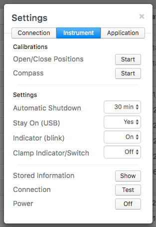

### Instrument Calibrations

PhotosynQ Instruments come pre-calibrated from the factory. Over time you can repeat the calibrations to ensure high quality measurements. Depending on the Instrument the available calibrations can vary. Currently you need to use the Desktop Application to adjust your Instrument settings.

***Note:*** The Chrome App does not support Instrument Calibrations. Please switch to the new Desktop Application.

#### Desktop App

When using the Desktop App in order to repeat the Instrument Calibrations, follow these steps to get started.

1. Connect your Instrument, using USB or Bluetooth.
2. Select **Instrument** from the **Settings** dialog.
3. Depending on the connected Instrument, you will see your available calibrations.

#### Calibrations MultispeQ v1.0

***Note:*** Available soon

#### Calibrations MultispeQ v2.0

| Calibration | Description |
|-------------|-------------|
| Open/Close Positions | Re-calibrate the open/close position of the leaf clamp. This is required, when the Instrument is not properly starting a protocol that starts on open or close. |
| Compass | Calibrate the Instrument's internal compass. |