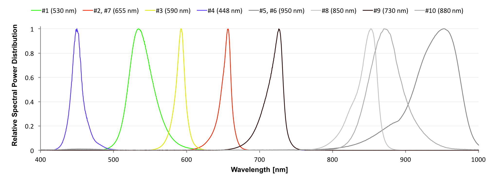

MultispeQ v1.0 Configuration
-------

### Lights
There are sets of five LEDs each on the **main body** and the **leaf clamp**.

##### Main Body

| # | Emission Peak | Model | Specifications |
|:---:|:---:|-----|:---:|
| 1 | 530nm | LED (green), Lumileds, LXZ1-PM01 | [view][LXZ1] |
| 2 | 655nm | LED (red), Lumileds, LXZ1-PA01 |[view][LXZ1] |
| 3 | 590nm | LED (amber), Lumileds, LXZ1-PL01 |[view][LXZ1] |
| 4 | 448nm | LED (blue), Lumileds, LXZ1-PR01 |[view][LXZ1] |
| 5 | 950nm | LED (NIR), OSRAM, SFH 4441 | [view][OSRAM SFH 4441] |

##### Leaf Clamp

| # | Emission Peak | Model | Specifications |
|:---:|:---:|-----|:---:|
| 6 | 950nm | LED (NIR), OSRAM, SFH 4441 | [view][OSRAM SFH 4441] |
| 7 | 655nm | LED (red), Lumileds, LXZ1-PA01 |[view][LXZ1] |
| 8 | 850nm | LED (NIR), OSRAM, SFH 4451 | [view][OSRAM SFH 4451] |
| 9 | 730nm | LED (far red), Everlight, ELSH-Q61F1-0LPNM-JF3F8 | [view][ELSH-Q61F1-0LPNM-JF3F8] |
| 10 | 880nm | LED (NIR), Kingbright, APTD3216SF4C | [view][APTD3216SF4C] |

##### Emission Spectra for LEDs

### Detectors
The MultispeQ v1.0 comes with two detectors. One covering the near infrared on the **main body**, the other covering the visual range on the **leaf clamp**.

| # | Detection Range | Model | Specifications |
|:---:|:---:|-----|:---:|
| 1 | 700nm - 1150nm | Hamamatsu, S6775-01 (main body) | [view][S6775-01] |
| 3\* | 400nm - 700nm | Hamamatsu, S6775 (leaf clamp) | [view][S6775] |

\****Note:*** The detector 3 is covered with a BG-18 bandpass filter with a center wavelength around 493 nm. If you are using the detector to detect signals on the edges of the detection range, expect the signal strength to be low.

### Sensors
The MultispeQ v1.0 has a set of sensors to measure the environmental parameters

| Sensor | Model | Specifications |
|-----|-----|:---:|
| Ambient Temperature, Humidity, Pressure (2x) | BOSCH, BME280 | [view][BME280] |
| Contactless Temperature | Melexis, MLX90615SSG-DAG-000-TU | [view][MLX90615] |
| Accelerometer | Freescale, MMA8653FCR1 | [view][MMA8653FCR1] |
| Magnetometer | Freescale, MAG3110FCR1 | [view][MAG3110FCR1] |
| Hall Effect Sensor | TT Electronics, OHS3150U | [view][OHS3150U] |
| PAR light sensor | AMS-TAOS USA, TCS34715FN + 700nm low pass filter | [view][TCS34715FN] |

### Filters
The MultispeQ v1.0 has two filters, a Band Pass filter covering the visible light detector (#3) and a Low Pass filter used in the PAR sensor.

| Filter | Model | Specifications |
|-----|-----|:---:|
| Band Pass | Schott, BG-18 1mm thickness  | [view][BG-18] |
| Low Pass | UQC Optics, Hot Mirror HM-07 | [view][HMC-5051] |

### Battery
The MultispeQ v1.0 has a Li-ion battery which can be charged through the micro USB port.

| Battery | Model | Specifications |
|-----|-----|:---:|
| Main | Soshine Li-ion 26650 Protected Battery: 5500mAh 3.7V | [view][26650P-3.7-5500] |

[LXZ1]: https://www.lumileds.com/products/color-leds/luxeon-z-colors

[OSRAM SFH 4441]: https://www.osram-os.com/osram_os/en/products/product-catalog/infrared-emitters%2c-detectors-andsensors/infrared-emitters/power-emitter-gt40mw/emitter-with-940-nm/sfh-4441/index.jsp

[OSRAM SFH 4451]: https://www.osram-os.com/osram_os/en/products/product-catalog/infrared-emitters%2c-detectors-andsensors/infrared-emitters/power-emitter-gt40mw/emitter-with-850-nm/sfh-4451/index.jsp

[ELSH-Q61F1-0LPNM-JF3F8]: https://www.everlight.com/SeriationProduct.aspx?Seq=A92E0EF4-2205-E411-8B3B-0002A54E500F

[APTD3216SF4C]: https://media.digikey.com/PDF/Data%20Sheets/Kingbright%20PDFs/APTD3216SF4C.pdf

[S6775]: https://www.hamamatsu.com/us/en/product/alpha/S/4103/S6775/index.html

[S6775-01]: https://www.hamamatsu.com/us/en/product/category/3100/4001/4103/S6775-01/index.html

[BME280]: https://www.bosch-sensortec.com/bst/products/all_products/bme280

[MLX90615]: https://www.melexis.com/en/product/MLX90615/Digital-Plug-Play-Infrared-Thermometer-Ultra-Small-TO-Can

[MMA8653FCR1]: https://www.nxp.com/products/sensors/accelerometers/3-axis-accelerometers/2g-4g-8g-low-g-10-bit-digital-accelerometer:MMA8653FC?lang_cd=en

[MAG3110FCR1]: https://www.nxp.com/products/sensors/magnetometers/high-accuracy-3d-magnetometer:MAG3110?lang_cd=en

[OHS3150U]: http://www.ttelectronics.com/sites/default/files/download-files/OHS3150U_3151U.pdf

[TCS34715FN]: https://ams.com/eng/Products/Light-Sensors/Color-Sensors/TCS34715

[BG-18]: https://www.us.schott.com/d/advanced_optics/380b879e-f6d3-4130-b7e9-52d794f9bc4b/1.2/schott-bandpass-bg18-jun-2017-en.pdf

[HMC-5051]: http://www.uqgoptics.com/pdf/Hot%20mirrors%20data%20sheet.pdf

[26650P-3.7-5500]: https://www.soshine.com.cn/a633.aspx