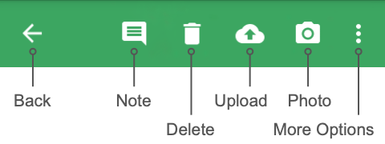

### Measurements - Mobile

The Measurements menu item is not to be confused with [Quick Measurements](mobile-app_Quick-Measurements), which is a list of Protocols available on PhotosynQ. Measurements is showing the history of Measurements collected for Projects. You can use the list to review your Measurements, as well as adding Notes and/or Photos, delete Measurements or upload them to the PhotosynQ cloud.

When no Measurements are selected, the following options are available to manage multiple Measurements.

#### Select Pending

Select all Measurements that have not been uploaded yet from the list of all Measurements for Projects on your device.

#### Cleanup Measurements

Once Measurements have been uploaded, they will remain on the list, indicated by a cloud icon. Use **Cleanup Measurements** from the **More Options** menu, to remove those Measurements. Measurements that are not uploaded yet will remain on the list.

After selecting **Measurements** from the Menu, a list will all Measurements taken for Projects is presented. Each Measurement is presented as one list item with the Project title, the given answers to the Project questions and the date and time.

#### Editing Measurements

Measurements that have been recorded for a Project can be supplemented with notes and photos or deleted, if they are not intended to be uploaded to a Project on the PhotosynQ cloud (See [Adding Notes and Pictures](./help/mobile-app_Adding_Notes_and_Pictures)).

***Note:*** You can only supplement the Measurements with information. The answers given for a Measurement cannot be altered!

#### Uploading Measurements

Measurements can be uploaded in bulk or individually. To upload them all at once, select the button **Upload All** at the bottom of the list. To upload Measurements individually, select a Measurement from the list and select the <i class="fa fa-cloud-upload" aria-hidden="true"></i> cloud icon from the menu on the top.

Once a Measurement is uploaded successfully, it is labeled with a green cloud icon.

***Tip:*** Make sure you upload cached measurements on a regular basis. Specially if you share the phone with others. Otherwise you might forget that there are measurements still on the device.

#### Submitted Measurements

Measurements that have already been uploaded are indicated by a cloud icon. You can select *Cleanup Measurements* from the <i class="fa fa-ellipsis-v" aria-hidden="true"></i> more options menu to remove those from the list.

***Note:*** Measurements which have been uploaded can not be altered and re-uploaded.