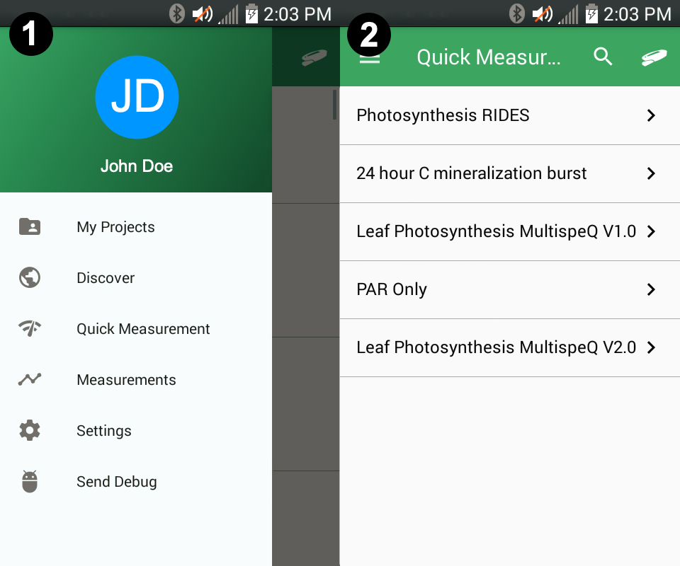

### Quick Measurements - Mobile

The mobile app allows you to select any Measurement Protocol available on the PhotosynQ platform to run as *Quick Measurement*. In this case the Protocols are not associated with a Project.

#### Selecting a Protocol

Select **Quick Measurement** from the menu. Only the **Staff Picks** are displayed, but you can search for any Protocol available on the PhotosynQ platform. Select the protocol you want to run and the Measurement will automatically start. The results will be displayed, but you will not be able to save them to your phone or external program. If you are planing on using saving Measurements, consider setting up a Project or use the Desktop Application.

***Tip:*** If you are planing on saving measurements, create a Project or for smaller experiments, use the Desktop Apps' [Notebook](desktop-app_Notebook).

***Note:*** Due to the large number of Protocols (with Macros) available, pre-loading the Protocols might take a while to finish, especially with older phones or a slower connection.