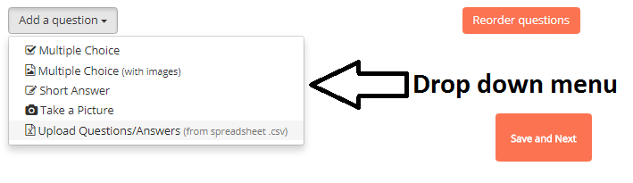

### What is a Project Question?

In Projects you can define Questions which have to be answered before each measurement (optional). These Questions can be used to input additional non sensor data (e.g. plant height) or to filter and categorize your measurements when you explore your Project data. Project Questions are important for improving the analysis and documentation of every contribution. Example questions could include:

- What is the variety?
- What is the treatment?
- What is the replicate?
- any many more...

***Tip:*** See the [tutorials](../tutorials/data_collection) on more information on Project Questions.

### Adding Project Questions

1. Select the type of question you want to add from the 'Add a question' drop down menu.
2. See below for instructions on creating each type of question.
3. Click 'Add a question' to add another question, you can add as many questions as you need.
4. To reorder questions, click on 'Reorder Questions.'
5. Drag the questions into the new order.
6. Select 'Done reorder.'
7. If you have added all of your questions and you are happy with the order of the questions, click on 'Save and Next.'

#### Multiple Choice

This is the best choice if you know all of the possible answers to the question

1. Input the question in the 'Question' box
2. Input the first answer in the 'Answers' field.
3. Click on 'ADD ANSWER' to add an additional answer box
4. Once you have input all of your answers, select 'Save.'

***Tip:*** Each answer needs to have its own answer box

#### Multiple Choice (with images)

This type of question is particularly useful if the images help to answer the question. An example might be determining the growth stage of a crop by inputting images of each growth stage as possible answers

1. Input the question in the 'Question' box
2. Drag and drop first image into the box or click on the box to choose the file to upload. It may take up to a minute for the file to upload.

3. Once you have selected the image, an 'Image Text' box will appear. **You must add an image description in the box.**
4. Drag and drop or select another image and repeat step 3.
5. Once you have added all of your answers, select 'Save.'

#### Short Answer

This type of question is best if you do not know all of the possible answers when you create the project.

1. Input the question into the question box.
2. Select 'Save.'

#### Take picture

Choose this question type if you want to force the data collector to take an image for **EVERY** measurement that is collected.

1. Input the picture instructions into the question box.
2. Select 'Save.'

#### Upload Questions/Answers form spreadsheet (.csv)

This option is best for projects that involve a large population of plants or many project questions. For directions on how to set up your .csv, see the '[Using the csv Upload Feature](../tutorials/data_collection)' document.

1. Drag and drop the csv into the box or click on the box to choose the csv file to upload.
2. Select 'Save.' It may take up to a minute for the file to upload.

### Is there a limit to the number of Project Questions?

**No**, but keep in mind that you will have to answer each question in the field, which can slow down data collection.
