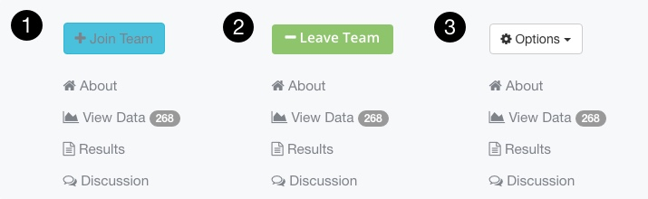

### Editing a Project

If you have administrative rights on a Project, either because you created the Project or because you were added as an Administrator, then you can make changes to a Project at any time.

1. Go to the Project homepage on <https://photosynq.org>.
2. Using the 'Options' drop down menu on the left of the screen, select what you want to edit.
3. Once you have finished making changes, you can 'Save and close' or you can navigate through other sections of your Project using the 'Back' and 'Save and Next' buttons.

***Note:*** If you do not see the 'Options' menu on the left side of your Project homepage, this means that you do not have administrative access to this Project.

