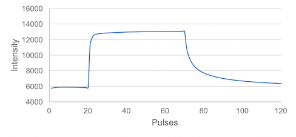

### Why do PhotosynQ measurements require Protocols and Macros?

On the PhotosynQ platform, we use **Protocols** to provide specific measurement instructions to the instrument, such as the MultispeQ. Every time a measurement is taken, the Protocol is sent to the instrument, and the results are sent back.

You can choose to attach a **Macro** to a Protocol. Macros are used to make calculations after a measurement has been taken. Not every measurement requires post processing (e.g. a simple temperature measurement), but if you want to calculate a parameter from the measurement **Trace** or want to compare parameters (e.g. ambient temperature vs. leaf temperature), a Macro will calculate the parameters of interest and display the results instantly on your mobile device (e.g. a phone).


### How do Protocols work

Protocols are written in the **J**ava**S**cript **O**bject **N**otation or [JSON][JSON_URL]. It's important to note that most scripting languages have the capability to parse, modify and validate a protocol. If the Protocol is sent to the instrument, it needs to be *parsed as a string* before is gets sent. Unless you build your own application, the PhotosynQ apps will take care of that for you.

### Before you Get Started

In order to build your first Protocol, make sure you have the [Desktop App] installed. You will also need an Instrument like the MultispeQ to test your protocol.

1. Select **Protocols** from the menu and click on `+ New` or select the **Protocol Editor** directly.
2. Check out the detailed documentation on how to create a protocol in our [wiki on github]
3. Make sure you have your instrument connected properly, so you can click on <code><i class="fa fa-play"></i> Run</code> to test your Protocol
4. Now you are ready to create your first Protocol…

### Measuring Photosystem II efficiency

In this tutorial, we show you how to acquire a simple Phi2 value using the MultispeQ. Before we start, lets take a look at the measurement.


**The measurement is divided into three parts:**

1. **20** Pulses at ambient light intensity
2. **50** Pulses at a saturating light intensity
3. **20** Pulses at ambient light intensity

This is all we need to record the photosystem II quantum efficiency, or Phi2. The following protocol has another 4000 pulses prior to the above-mentioned protocol, to adapt the leaf to the ambient light intensity, which is recreated inside the MultispeQ instrument.

#### Pulses

A measurement is divided into pulses. Pulses can be grouped into pulse sets. The example below shows a total of **4,090** pulses grouped into **4** pulse sets. Most of the following parameters require you to define those **4** groups. `pulses` defines those groups, `pulse_distance` defines how far apart each pulse is (in *µs*). The command `pulse_length` defines the pulse duration in *µs*.

**Table View**

| pulses | pulse_distance | pulse_length |
| :-- | :-- |  :-- |
| 4000 | 1000 |  30 |
| 20 | 10000 | 30 |
| 50 | 10000 | 30 |
| 20 | 10000 | 30 |

**Advanced View**

```javascript
[
    {
        "pulses": [
            4000, 20, 50, 20
        ],
        "pulse_distance": [
            1000, 10000, 10000, 10000
        ],
        "pulse_length": [
            [ 30 ], [ 30 ], [ 30 ], [ 30 ]
        ],
        ...
    }
]
```

***

#### Pulsed lights

Once we have defined are pulse groups, we need to define the lights we want to use to probe the fluorescence. `pulsed_lights` defines which lights are pulsed during each pulse set. `0` means that there is no light pulsing, `3` uses the 605 nm LED (amber), Lumileds LXZ1-PL01. `pulsed_lights_brightness` defines the light intensity of each pulse. Since multiple lights can be pulsed, lights or brightness are written like `[3]` this and not simply like `3`. Multiple light would be written in this way: `[2,3]`.

**Table View**

| pulsed_lights | pulsed_lights_brightness |
| :-- | :-- |
| 0 | 0 |
| 3 | 2000 |
| 3 | 2000 |
| 3 | 2000 |

**Advanced View**

```javascript
[
    {
        ...,
        "pulsed_lights": [
            [ 0 ], [ 3 ], [ 3 ], [ 3 ]
        ],
        "pulsed_lights_brightness": [
            [ 0 ], [ 2000 ], [ 2000 ], [ 2000 ]
        ],
        ...
    }
]
```

***

#### Non Pulsed Lights

In this protocol we need an actinic light (which is not pulsed), so the plant has light available to continue doing photosynthesis during the measurement. To set the intensity we use the command `light_intensity` to reproduce the ambient light intensity, which is recorded by the PAR sensor. Light `2` is the 655 nm LED (red), Lumileds LXZ1-PA01.

**Table View**

| nonpulsed_lights | nonpulsed_lights_brightness |
| :-- | :-- |
| 2 | light_intensity |
| 2 | light_intensity |
| 2 | 4500 |
| 2 | light_intensity |

**Advanced View**

```javascript
 [
    {
        ...,
        "nonpulsed_lights": [
            [ 2 ], [ 2 ], [ 2 ], [ 2 ]
        ],
        "nonpulsed_lights_brightness": [
            [ "light_intensity" ], [ "light_intensity" ], [ 4500 ], [ "light_intensity" ]
        ],
        ...
    }
 ]
```

***

#### Detectors
Next we have to define the detector we want to use to record the fluorecence coming off the leaf. We use the command `detectors` to define which detector we will use for each pulse set. Since we can use multiple detectors per pulse set we use `[1]` instead of the `1` notation (using two detectors would look like this: `[1,2]`). When the detector is set to `0` no data is captured. Detector `1` is the 700 nm - 1150 nm, Hamamatsu S6775-01.

**Table View**

| detectors |
| :-- |
| 0 |
| 1 |
| 1 |
| 1 |

**Advanced View**

```javascript
[
    {
        ...,
        "detectors": [
            [ 0 ], [ 1 ], [ 1 ], [ 1 ]
        ]
        ...,
    }
]
```

***

#### Environmentals

To record the ambient light intensity required for the non pulsed lights intensity, we have to add a command to include the PAR sensor using `light_intensity`. This is also where you could add other environmental parameters like temperature, relative humidity, etc, depending on the sensors available in your instrument.

**Table View (Fixed)**

    environmental
    [
        [
            "light_intensity"
        ]
    ]

**Advanced View**

```javascript
[
    {
        ...,
        "environmental": [
            [ "light_intensity" ]
        ],
        ...
    }
]
```

***

#### Start measurement

To start the measurement as soon as we have clamped the leaf, in order to perturb it as little as possible, we add the following command: `1` indicates the measurement starts as soon as the clamp is closed and `0` starts the measurement as soon as you select `Start Measurement` on your device.

**Table View (Fixed)**

    open_close_start
    1

**Advanced View**

```javascript
[
    {
        ...,
        "open_close_start": 1
    }
]
```

***

### The final Protocol

Putting all the pieces together, the protocol to measure Phi2 looks like this:

**Table View**

| pulses | pulse_distance | pulse_length | pulsed_lights | pulsed_lights_brightness | nonpulsed_lights | nonpulsed_lights_brightness | detectors |
| :-- | :-- | :-- | :-- | :-- | :-- | :-- | :-- | :-- | :-- |
| 4000 | 1000 | 30 | 0 | 0 | 2 | light_intensity | 0 |
| 20 | 10000 | 30 | 3 | 2000 | 2 | light_intensity | 1 |
| 50 | 10000 | 30 | 3 | 2000 | 2 | 4500 | 1 |
| 20 | 10000 | 30 | 3 | 2000 | 2 | light_intensity | 1 |

    environmental
    [
        [
            "light_intensity"
        ]
    ]

    open_close_start
    1

**Advanced View**

```javascript
[
    {
        "pulses": [
            4000, 20, 50, 20
        ],
        "pulse_distance": [
            1000, 10000, 10000, 10000
        ],
        "pulse_length": [
            [ 30 ], [ 30 ], [ 30 ], [ 30 ]
        ],
        "pulsed_lights": [
            [ 0 ], [ 3 ], [ 3 ], [ 3 ]
        ],
        "pulsed_lights_brightness": [
            [ 0 ], [ 2000 ], [ 30 ], [ 30 ]
        ],
        "nonpulsed_lights": [
            [ 2 ], [ 2 ], [ 2 ], [ 2 ]
        ],
        "nonpulsed_lights_brightness": [
            [ "light_intensity" ], [ "light_intensity" ], [ 4500 ], [ "light_intensity" ]
        ],
        "detectors": [
            [ 0 ], [ 1 ], [ 1 ], [ 1 ]
        ],
        "environmental": [
            [ "light_intensity" ]
        ],
        "open_close_start": 1
    }
]
```

***Tip:*** Continue with the Macro Tutorial to learn how to calculate Phi2 from the recorded measurement.

[JSON_URL]: https://www.w3schools.com/js/js_json_intro.asp
[Desktop App]: https://chrome.google.com/webstore/detail/photosynq/mdbljehgiahgijmaeehfigldmmaofilg
[wiki on github]: https://github.com/Photosynq/PhotosynQ-Firmware/wiki
