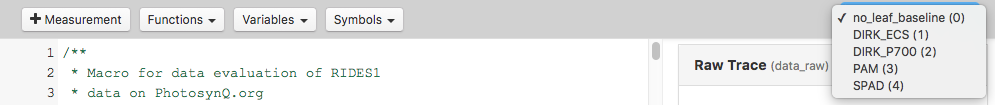

### Building an Advanced Macro

When building a Macro for a Protocol using the `_protocol_set_` command, you start of the same way as building a macro discribed in the previous example ([Building a Macro](/tutorials/building_a_macro)). But since a protocol set was used, accessing the retuned Parameters has changed a little.

### The `json.set` Object

The object `json` is no longer holding all the measured Parameters as shown in the previous tutorial. Instead it has a key called `set` with all Protocols from the Protocol Set. Since `json.set` is an array of Protocols, you have to provide the index as well. If you want to access the third Protocol for example, you simply use `json.set[2]`. This can get a bit confusing, when you are using multiple Protocols inside your Set. To make it more accessible, the Macro Editor provides a dropdown menu in the top menu bar with all available Protocols inside a Set numbered starting from 0. If you use the `label` command inside each protocol, you will see the label in the dropdown menu making the access easier. After selecting the Protocol from the Set, use **Variables** from the top menu, to see and access all Parameters in the selected Protocol.



##### Simple Protocol Set Example

```javascript
/**
 * Macro for data evaluation on PhotosynQ.org
 * by: John Doe
 * created: June 4, 2018 4:00 PM
 */

 // Define the output object here
var output = {};

// Check if the key time exists in the third protocol of the set
if (json.set[2].time !== undefined){
    // Add key time and value to output
    output.time = json.set[2].time;
}

// Return data
return output;
```
