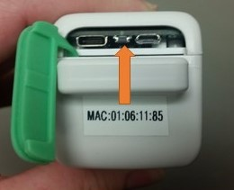
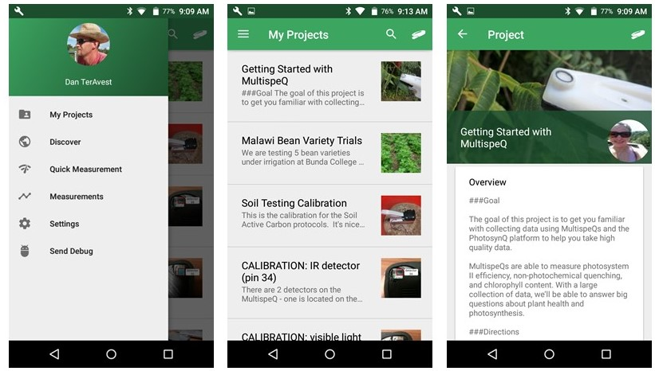

### Creating an account

Before you can start using PhotosynQ, you will need to create an account. 

1.	You can create an account from the [website](https://photosynq.org/), the desktop app, or the mobile app.  
	- Using the website: click on the ‘sign up’ button in the upper right corner of the website.  
	- Using the desktop app: Download the **Desktop** app from [PhotosynQ](https://photosynq.org/software) and select "sign up."
	- Using the mobile app: Download the **Mobile** app from the Google [Playstore](https://play.google.com/store/apps/details?id=org.photosynq.android.photosynq) and select "no account? Register here."
2.	Create a username and password for your account. This login will be used across the PhotosynQ platform.
3.	Check your email for a confirmation.  
	- If you do not see it, check your spam folder.  
	- Once you confirm, your account will be been created!
4.	Now go back to the website or app and sign in.
 
***

### Connect an Instrument
You can use Bluetooth or USB to connect your Instrument with your device. Depending on the instrument and device, some connection options may not be available.

For data collection in the field, most people will use the mobile app. So lets focus on connecting the MultispeQ to your android phone. For tips on how to connect to the PhotosynQ desktop app please check out [Connect an instrument](https://photosynq.org/help/apps_Connect_an_Instrument) in the [Help Center](https://photosynq.org/help).

**Before connecting your MultispeQ to the Android or Desktop App you need to turn on the MultispeQ by pressing and holding the power button for 5 seconds.** There is no indicator light to let you know if it is turned on.
 

1. In the app, select the instrument icon on the top right corner.
2. A list of available Bluetooth instruments will appear. 
3. Below the Instrument name will be its ID. This should match the MAC address on your instrument (screen A, below)
	- If your instrument does not appear, click on **SCAN DEVICES**
	- You may have to click **SCAN DEVICES** multiple times before your instrument appears.
4. Select on the appropriate instrument.
5. A pop-up will appear asking to pair the device by entering the instrument PIN. **The PIN is 1234 and is the same for every MultispeQ.**
6. After pairing the MultispeQ, you will be taken back to the Device list. Select your MultispeQ from the list, if the screen B (below) appears your device is connected.

**You are now ready to take measurements with your MultispeQ!**

*If you are having trouble connecting to the MultispeQ, please look for trouble shooting tips in the [help center](https://photosynq.org/help/apps_Connect_an_Instrument)

***

### PhotosynQ Projects ###

**Projects are the lifeblood of PhotosynQ, so it is important to understand what you are looking at!**

- Inside the app, you can find all the projects you have either created or joined. You can do this by selecting the menu in the upper left corner of the app and then selecting **My Projects**.
- Everyone is automatically joined to the tutorial project, [Getting Started with Multispeq](https://photosynq.org/projects/getting-started-with-multispeq)
- Check out the overview and directions for the project.  
	1. These are sometimes the only source of communication between the project creator and you.  
	2. Reading the directions is vital to taking proper measurements.  
- Any additional questions about projects can be asked on the project discussion online.  

Take a few measurements using the **Getting Started with MultispeQ** project or [create your own project](https://photosynq.org/projects/categories).